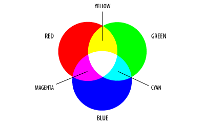
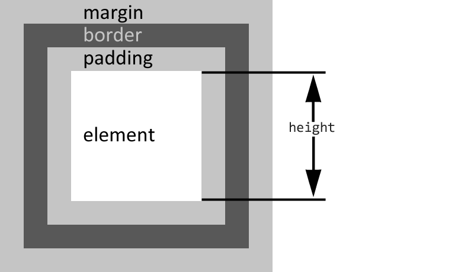
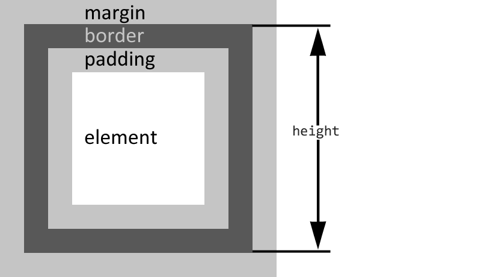

# CSS. Погружение

## О форматировании <a href="#codestyle" id="codestyle"></a>

Нет, я не властен над собой, и таки приведу в качестве примера используемое мной CSS-форматирование:

```css
/* Header */
header {
    margin-bottom: 16px;
    font-weight: 400;
}

header h1 {
    color: #999;
}

header p {
    font-size: 1.4em;
    margin-top: 0;
}
/* /Header */
```

Почему это хорошо:

* такой CSS легко читается
* есть идентификатор начала блока (можно быстро найти необходимую часть даже в очень большом CSS-файле используя поиск по метке `* header`)
* подобное форматирование явно указывает на вложенность элементов
* и можно легко проследить наследование свойств

Я не настаиваю на своём варианте, но хотелось бы, чтобы вы приняли на вооружение один из многих стандартов форматирования и всегда следовали ему.

> Когда станете матёрыми front-end разработчиками – познаете всю силу CSS-препроцессоров, а пока слушайте и запоминайте.

Это визуальное усложнение предназначено для людей; для браузеров оно не играет никакой роли, так как они всё равно при работе со стилями проводят конкатенацию, то есть удаляют переносы строк, отступы, комментарии, некритические пробелы. Некоторые типы web-серверов, например, для банковских тонких клиентов, проводят сжатие (и архивацию) файлов ещё до пересылки к месту использования, из экономии трафика и денег.

## Именование классов и идентификаторов <a href="#naming-convention" id="naming-convention"></a>

Я уже затрагивал эту тему, когда рассказывал о релевантности HTML, так вот – имена классов могут быть даже такими: `b-service-list__column b-service-list__column_right` и это будет круто, и «must have» – но лишь в рамках действительно больших проектов. Собственно, чего я распинаюсь? Дам для изучения [исходную точку](https://ru.bem.info/methodology/), информации там – ещё на одну книгу ;)


Рекомендую ознакомиться с [принципами БЭМ](https://ru.bem.info/methodology/) – это полезно для расширения кругозора и прокачки скиллов.


## О цветах <a href="#css-colors" id="css-colors"></a>

В WEB используется цветовая модель [RGB](https://www.w3.org/TR/css-color-3/#rgb-color), именуемая по английским именам «несущих» цветовых каналов – red, green, blue – которая опирается на цифровое обозначение для любых оттенков. Поэтому красный цвет можно записать не только как «red», но и ещё несколькими способами:

```css
p { color: red }

p { color: #ff0000 }

p { color: #f00 }   /* сокращённая запись, экономит 3 байта */

p { color: rgb(255, 0, 0) }
```

> Теперь вы без запинки должны назвать цвета `#f00`, `#0f0`, `#00f`, а те, у кого по рисованию было «отлично», назовут и `#ff0`, `#0ff` и `#f0f` ;)

В CSS 3 поддерживается усовершенствованная модель [RGBA](https://www.w3.org/TR/css-color-3/#rgba-color), где мы дополнительно можем задать значение α-канала, т.е. прозрачность:

```css
p { color: rgba(255, 0, 0, 1) }   /* обычный текст */

p { color: rgba(255, 0, 0, 0.5) } /* полупрозрачный текст */
```

Ещё одна примочка CSS 3 – это возможность использования цветовых моделей [HSL](https://www.w3.org/TR/css-color-3/#hsl-color) (hue, saturation, lightness – оттенок, насыщенность и яркость; озвучивается как «хью, сатурейшн, лайтнесс») и [HSLA](https://www.w3.org/TR/css-color-3/#hsla-color) (HSL + α-канал):

```css
p { color: hsl( 0, 100%, 50%) }   /* красный */

p { color: hsl(120, 100%, 50%) }  /* зелёный */

p { color: hsl(240, 100%, 50%) }  /* синий */

p { color: hsla( 0, 100%, 50%, 0.5) } /* полупрозрачный красный */
```

Для перевода из модели HSL в модель RGB существует простой алгоритм, но пока не стоит им себя грузить.

> Да кто этим HSL пользуется? ~~Не морочьте себе голову!~~ HSL становится всё более популярным, и вы должны про него знать, и даже понимать как он работает!

Тем, кого вопрос со смешанием каналов RGB поставил в тупик, наглядное руководство:



## Блочные и строчные элементы <a href="#block-and-inline" id="block-and-inline"></a>

Возможно, вы ещё не знаете, но HTML-теги делятся на блочные (block-тип) и строчные (inline-тип). Блочными элементами называют те, которые отображаются как прямоугольник, занимают всю доступную ширину внутри элемента-родителя, и их высота определяется их содержимым. Блочные теги по умолчанию начинаются и заканчиваются новой строкой — это `<div>`, `<h1>` и собратья, `<p>` и другие.

Если хотите, чтобы ваш HTML оставался валидным, следите за тем, чтобы блочные элементы не располагались внутри строчных элементов. Внутри строчных тегов может быть либо текст, либо другие строчные элементы.

> Одна из часто встречаемых мной ошибок, это когда в параграф `<p>` пытаются закидывать если не список `<ul>`, то кнопку `<button>`.  Не надо так.&#x20;

Полезные статьи по теме:

* [Inline Elements List and What’s New in HTML5](https://www.tutorialchip.com/tutorials/inline-elements-list-whats-new-in-html5/)
* [HTML5 Block Level Elements: Complete List](https://www.tutorialchip.com/tutorials/html5-block-level-elements-complete-list/)
* [Блочная модель](https://doka.guide/css/box-model/)
* [Раскладка в CSS: поток](https://softwaremaniacs.org/blog/2005/08/27/css-layout-flow/)

## О размерах блочных элементов <a href="#size" id="size"></a>

Ещё хотел отдельно остановиться на вычислении ширины и высоты блочных элементов, ведь тут есть один нюанс. По умолчанию высота и ширина элементов считаются без учета толщины границ и внутренних отступов, т.е. как-то так:



Эта блочная модель называется «content-box», и вот в CSS3 появилась возможность изменять блочную модель, указывая атрибут «box-sizing». Отлично, теперь мы можем выбирать между двумя значениями «content-box» и «border-box». Первый я уже описал, а вот второй вычисляет высоту и ширину включая внутренние отступы и толщину границ:



Полезные статьи по теме:

* [Блочные элементы](https://htmlbook.ru/content/blochnye-elementy)
* [Встроенные элементы](https://htmlbook.ru/content/vstroennye-elementy)

## Плавающие элементы <a href="#float" id="float"></a>

Я бы хотел ещё рассказать о CSS-свойстве `float`, но боюсь, рассказ будет долгим и утомительным. Кратенько: если вы указываете элементу свойство `float`, то:

* наш элемент будет смещён по горизонтали, и «прилипнет» к указанному краю родительского элемента
* если это был блочный элемент, то теперь он не будет занимать всю ширину родительского элемента и освободит место
* если следом идут блочные элементы, то они займут его место
* если следом идут строчные элементы, то они будут обтекать наш элемент со свободной стороны

Это поведение «по умолчанию», а как это выглядит вживую можно посмотреть на примере [css.float.html](https://anton.shevchuk.name/book/code/css.float.html).

Тут главное понимать происходящее и уметь управлять, если, конечно, вы хотите хоть чуть-чуть научиться верстать :)


Понимание работы `float` в CSS — один из многих навыков, которым должен обладать верстальщик. Для общего ознакомления рекомендую статью «[Раскладка в CSS: float](https://softwaremaniacs.org/blog/2005/12/01/css-layout-float/)»


## Позиционирование <a href="#position" id="position"></a>

Дам лишь вводную по `position`. У него есть пять основных значений:

* `static` — положение дел «по умолчанию», элементы располагаются в нормальном потоке документа один за другим сверху вниз
* `absolute` — элемент позиционируется относительно ближайшего позиционированного предка (не `static`), согласно указанным координатам
* `fixed` — элемент фиксируется на определенном месте в окне просмотра, не перемещаясь при прокрутке страницы
* `relative` — элемент ведет себя как `static`, но его можно сместить относительно его обычного положения, также служит контекстом для позиционирования внутренних «абсолютных» элементов
* `sticky` — элемент "приклеивается" к определенному месту в окне просмотра при прокрутке страницы до достижения заданного порога, работая как сочетание `relative` и `fixed`


Для самостоятельного изучения:

— [Раскладка в CSS: позиционирование](http://softwaremaniacs.org/blog/2005/08/03/css-layout-positioning/) — слегка устаревшая статья, но всё же она тут

— [CSS-position](https://developer.mozilla.org/ru/docs/Web/CSS/position) — мануалы на dev.mozilla.org всегда актуальны, не всегда с переводом

— [Дока-справочник по CSS](https://doka.guide/css/) — много всего про CSS, понятным языком

