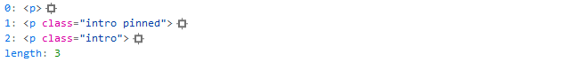

# Селекторы

Как я уже говорил ранее, в поиске элементов на странице заключается практически половина успешной работы с jQuery. Так что приступим к поискам по документу.

### Идентификатор и классы

Выбор элементов по `id` либо имени класса, аналогично используемым в CSS:

<table data-header-hidden><thead><tr><th width="303">селектор</th><th></th></tr></thead><tbody><tr><td><code>$("#content")</code></td><td>выбираем элемент с <code>id="content"</code></td></tr><tr><td><code>$("section#content")</code></td><td>выбираем <code>&#x3C;section></code> с <code>id="content"</code></td></tr><tr><td><code>$(".intro")</code></td><td>выбираем элементы с <code>class="intro"</code></td></tr><tr><td><code>$(".intro.pinned")</code></td><td>выбираем элементы с классами <code>intro</code> и <code>pinned</code></td></tr><tr><td><code>$("h3")</code></td><td>выбираем все теги <code>&#x3C;h3></code></td></tr><tr><td><code>$("h1, h2")</code></td><td>выбираем все теги <code>&#x3C;h1></code> и <code>&#x3C;h2></code></td></tr></tbody></table>


Используйте валидные имена классов и идентификаторов


### Дочерние элементы

Теперь вспомним, что мы в DOMе не одни, это-таки иерархическая структура:

<table data-header-hidden><thead><tr><th width="307">селектор</th><th></th></tr></thead><tbody><tr><td><code>$("article h3")</code></td><td>выбираем все теги <code>&#x3C;h3></code> внутри тега <code>&#x3C;article></code></td></tr><tr><td><code>$("article").find("h3")</code></td><td>аналогично примеру выше</td></tr><tr><td><code>$("section article h3")</code></td><td>выбираем все теги <code>&#x3C;h3></code> внутри тега <code>&#x3C;article></code>, которые находятся внутри тега <code>&#x3C;section></code>, <em>в DOMе который построил Джек</em></td></tr><tr><td><code>$("section")</code><br>  <code>.find("article")</code><br>  <code>.find("h3")</code></td><td>и ещё раз, но на другой лад, и под капотом работает иначе, но мы про это ещё поговорим</td></tr></tbody></table>

### Соседние элементы

У нас есть соседи, и у нас с ними налажен контакт. Вот вам несколько способов как найти их:

<table data-header-hidden><thead><tr><th width="309">селектор</th><th></th></tr></thead><tbody><tr><td><code>$("article + article")</code></td><td>выбор всех элементов <code>&#x3C;article></code>, перед которыми есть тег <code>&#x3C;article></code></td></tr><tr><td><code>$("#stick ~ article")</code></td><td>выбор всех элементов <code>&#x3C;article></code> после элемента с <code>id="stick"</code></td></tr><tr><td><code>$("#stick").next()</code></td><td>выбор следующего элемента после элемента с <code>id="stick"</code></td></tr></tbody></table>

### Потомки и родители

Родственные связи решают:

<table data-header-hidden><thead><tr><th width="306">селектор</th><th></th></tr></thead><tbody><tr><td><code>$("article > h3")</code></td><td>выбираем все теги <code>&#x3C;h3></code>, которые являются непосредственными потомками тега <code>&#x3C;article></code></td></tr><tr><td><code>$("article > *")</code></td><td>выбор всех потомков элементов <code>&#x3C;article></code></td></tr><tr><td><code>$("article").children()</code></td><td>аналогично примеру выше</td></tr><tr><td><code>$("p").parent()</code></td><td>выбор всех прямых предков элементов <code>&#x3C;p></code></td></tr><tr><td><code>$("p").parents()</code></td><td>выбор всех предков элементов <code>&#x3C;p></code><br>достаточно экзотичная задача</td></tr><tr><td><code>$("p").parents("section")</code></td><td>выбор всех предков элемента <code>&#x3C;p></code>, которые есть <code>&#x3C;section></code> (<code>parents()</code> принимает в качестве параметра селектор)</td></tr></tbody></table>


`$("*")` – выбор всех элементов; следует использовать с огромной осторожностью


### Поиск по атрибутам

Ещё со времён CSS2 была возможность найти элемент с определёнными атрибутами, в [CSS3](https://www.w3.org/TR/selectors-3/) расширили возможности [поиска по атрибутам](https://www.w3.org/TR/selectors-3/#attribute-selectors):\`

<table data-header-hidden><thead><tr><th width="306">селектор</th><th></th></tr></thead><tbody><tr><td><code>$("a[href]")</code></td><td>все ссылки с атрибутом <code>href</code></td></tr><tr><td><code>$("a[href=#]")</code></td><td>все ссылки с <code>href=#</code></td></tr><tr><td><code>$("a[href~=#]")</code></td><td>все ссылки с <code>#</code> где-то в <code>href</code></td></tr><tr><td><code>$("a[hreflang|=en]")</code></td><td><p>все ссылки, со словом <code>en</code> в <code>hreflang</code> </p><p>символ <code>-</code>  воспринимается как разделитель для слов:  <code>en</code>, <code>en-US</code>, <code>en-UK</code></p></td></tr><tr><td><code>$("a[href^=https]")</code></td><td>ссылки, начинающиеся с <code>https</code></td></tr><tr><td><code>$("a[href*='google.com']")</code></td><td>ссылки на «погуглить»</td></tr><tr><td><code>$("a[href$=.pdf]")</code></td><td>ссылки на PDF-файлы (по идее)</td></tr></tbody></table>


Если вы решите заглянуть внутрь jQuery, то вы, скорей всего, найдете то самое место, где ваше выражение будет анализироваться с помощью регулярных выражений, по этой причине в селекторах необходимо экранировать специальные символы, используя двойной обратный слеш «`\\`»:

```javascript
$("a[href^=\\/]").addClass("internal");
```


### Структурные псевдоклассы

Хотелось бы ещё обратить внимание на [структурные псевдоклассы](https://www.w3.org/TR/selectors-3/#structural-pseudos) из спецификации [CSS3](https://www.w3.org/TR/selectors-3/), там много интересных и полезных, например:

<table data-header-hidden><thead><tr><th width="321">селектор</th><th></th></tr></thead><tbody><tr><td><code>$("ul li:first-child")</code></td><td>первый дочерний элемент</td></tr><tr><td><code>$("ul li:last-child")</code></td><td>последний дочерний элемент</td></tr><tr><td><code>$("ul li:nth-child(2n+1)")</code></td><td><p>выборка элементов по несложному уравнению </p><p>подробнее можно прочитать в статье «<a href="https://web-standards.ru/articles/nth-child/">Как работает nth-child</a>»</p></td></tr></tbody></table>

### Псевдокласс отрицания

Псевдокласс отрицания `:not()` единственный в своём роде, он позволяет выбрать все элементы, что не подпадают под вложенную выборку в скобках

<table data-header-hidden><thead><tr><th width="321">селектор</th><th></th></tr></thead><tbody><tr><td><code>$("a:not(.active)")</code></td><td>все ссылки <code>&#x3C;a></code> без класса <code>active</code></td></tr><tr><td><code>$("a").not(".active")</code></td><td>аналогичный результат, используя метод <code>.not()</code></td></tr></tbody></table>

> Если хотите поиграться с селекторами от души, то откройте страничку [css.selectors.html](https://anton.shevchuk.name/book/code/css.selectors.html) в новой вкладке,  и там вы сможете потренироваться в написании селекторов используя меню справа

### Результаты «выборов»

Когда с помощью перечисленных запросов вы нашли (или не нашли) DOM-элементы, вам вернётся jQuery-объект, который будет содержать массив этих элементов. Вот так это будет выглядеть для запроса

:



Возможно, вы заметили свойство `length`. Да-да, именно так, это количество найденных элементов. Так что мы можем легко получить оное число с помощью следующего кода:

```javascript
alert( $("p").length )
```

Если перед вами стоит задача достать найденный DOM-элемент, то вы сможете это сделать, зная его индекс. По сути, это выглядит как обращение к элементу массива:

```javascript
// мы ищем все параграфы
// берём первый из них
// берём текст параграфа
// возвращаем длину текста
alert( $("p")[0].innerText.length )
```

Если вам не нравится данный способ из эстетических соображений, то вы можете воспользоваться методом `.get()`:

```javascript
alert( $("p").get(0).innerText.length )
```
