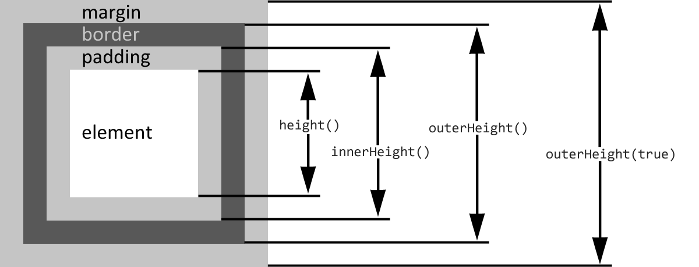

# Размеры

Переварили предыдущий раздел? Хорошо, теперь настал черёд методов, которые работают с размерами элементов.


Но прежде чем продолжить, рекомендую освежить в памяти информацию о [вычислении высоты и ширины блочных элементов](../0\_html\_css\_javascript/advanced-css.md#size) ;)


<table data-header-hidden><thead><tr><th width="323">метод</th><th>описание</th></tr></thead><tbody><tr><td><pre class="language-javascript"><code class="lang-javascript">height()
</code></pre></td><td>возвращает высоту элемента за вычетом отступов и границ; <br><br>если у нас несколько элементов в выборке, то вернётся первый; <br><br>значение, в отличие от метода <code>css("height")</code>, возвращается без указания единиц измерения</td></tr><tr><td><pre class="language-javascript"><code class="lang-javascript">height(height)
</code></pre></td><td><p></p><p>устанавливает высоту всех элементов в выборке; <br><br>если значение высоты передано без указания единиц измерения, то это будут пиксели <code>px</code></p></td></tr></tbody></table>


Памятка из мануала

```javascript
$(window).height();   // высота окна
$(document).height(); // высота HTML документа
```


Методы `width()` и `width(width)` – ведут себя аналогично методу `height()`, но работают с шириной элемента:

<table data-header-hidden><thead><tr><th width="323">метод</th><th>описание</th></tr></thead><tbody><tr><td><pre class="language-javascript"><code class="lang-javascript">width()
</code></pre></td><td>возвращает ширину элемента за вычетом отступов и границ; <br><br>если у нас несколько элементов в выборке, то вернётся первый; <br><br>значение возвращается без указания единиц измерения</td></tr><tr><td><pre class="language-javascript"><code class="lang-javascript">width(height)
</code></pre></td><td><p></p><p>устанавливает ширину всех элементов в выборке; <br><br>если значение высоты передано без указания единиц измерения, то это будут пиксели <code>px</code></p></td></tr></tbody></table>


Методы `height()` и `width()` **не изменяют** своего поведения в зависимости от выбранной блочной модели, т.е. они всегда возвращают параметры области внутри `margin`, `padding` и `border` элемента.


<table data-header-hidden><thead><tr><th width="323">метод</th><th>описание</th></tr></thead><tbody><tr><td><pre class="language-javascript"><code class="lang-javascript">innerHeight()
innerWidth()
</code></pre></td><td>возвращают, соответственно, высоту и ширину элемента, включая <code>padding</code></td></tr><tr><td><pre class="language-javascript"><code class="lang-javascript">outerHeight()
outerWidth()
</code></pre></td><td>возвращают высоту и ширину элемента, включая <code>padding</code> и <code>border</code></td></tr><tr><td><pre class="language-javascript"><code class="lang-javascript">outerHeight(true)
outerWidth(true)
</code></pre></td><td>возвращают высоту и ширину элемента, включая <code>padding</code>, <code>border</code> и <code>margin</code></td></tr></tbody></table>

Для наглядности различий между методами `height()`, `innerHeight()` и `outerHeight()` я создал следующий пример:



В данном примере для центрального элемента c `id=block` заданы следующие стили:

```css
#block {
  height: 40px;
  margin: 40px;
  padding: 40px;
  border: 40px solid #777;
}
```

Теперь посмотрим на то, что будет возвращать каждая из перечисленных функций:

```javascript
alert(`
  height()          = ${$("#block").height()}
  innerHeight()     = ${$("#block").innerHeight()}
  outerHeight()     = ${$("#block").outerHeight()}
  outerHeight(true) = ${$("#block").outerHeight(true)}
`);
```

Чтобы легче понять происходящее, я ещё немного заморочился и переделал несколько картинок из официальной документации в одну полноценную иллюстрацию:



