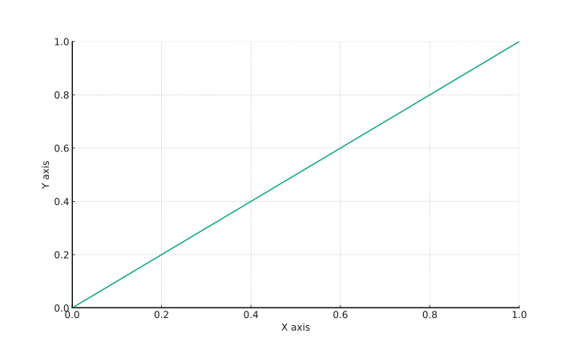
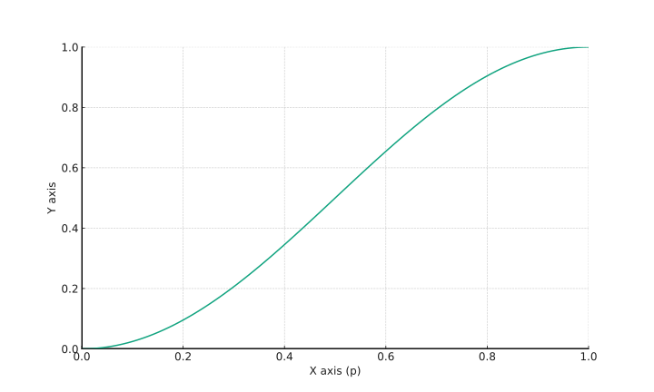

# Easing функции

Поигрались и хватит, пора усложнить вам жизнь. У метода `animate()` может быть более одного аргументов, и пора приступить к их разбору. Набор аргументов может быть разным; приведу первый, тот, что попроще:

<table data-header-hidden><thead><tr><th width="243">параметр</th><th>назначение</th></tr></thead><tbody><tr><td><code>properties</code></td><td>CSS-свойства – с этим мы уже познакомились</td></tr><tr><td><code>duration</code></td><td>скорость анимации, уже упоминалась ранее, указывается в миллисекундах, или используя ключевые слова «<code>fast</code>» или «<code>slow</code>»</td></tr><tr><td><code>easing</code></td><td>указываем, какую функцию будем использовать для изменения значений</td></tr><tr><td><code>complete</code></td><td>функция, которая будет вызвана после окончания анимации</td></tr></tbody></table>

Из приведённых параметров нам только «`easing`» не встречался ранее – я его берёг для данного момента. Этот параметр указывает, какая функция будет использоваться для процесса анимации значений. Это могут быть линейные, квадратичные, кубические и любые другие функции. «Из коробки» мы можем выбрать лишь между «`linear`»:

<figure><figcaption><p>linear</p></figcaption></figure>

и «`swing`»:

<figure><figcaption><p>swing</p></figcaption></figure>

Заглянув в код jQuery, мы легко найдём соответствующий код:

```javascript
jQuery.easing = {
    linear: function( p ) {
        return p;
    },
    swing: function( p ) {
        return 0.5 - Math.cos( p * Math.PI ) / 2;
    },
    _default: "swing"
};
```


`p` – коэффициент прохождения анимации, изменяется от 0 до 1.


Хотите больше easing-функций? Тогда ищите easing plugin на странице [https://gsgd.co.uk/sandbox/jquery/easing/](https://gsgd.co.uk/sandbox/jquery/easing/), он действительно из разряда «must have».



> В качестве путеводителя по easing-функциям можете использовать страничку [https://easings.net/](https://easings.net/).

О том, как написать свою функцию для анимации я расскажу попозже.
