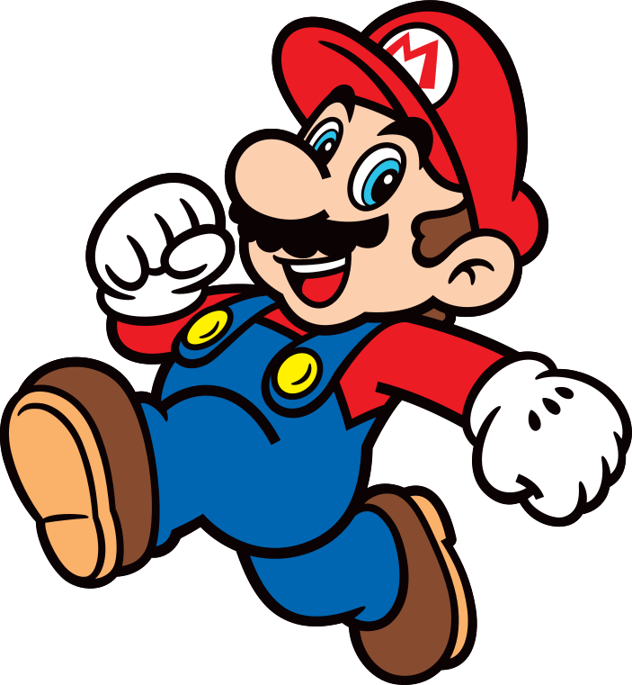

# В очередь…©

Немного об очередности работы метода «.animate()». Большинство читателей, наверное, уже знакомо с организацией последовательной анимации. Для этого мы можем использовать цепочку вызовов:

```javascript
// находим нужный элемент
$('#box')
  // указываем что хотим анимировать
  .animate({left:'-=100'})
  // следующий вызов анимации добавляется в очередь на выполнение
  .animate({top:'-=100'})
```

Для параллельного запуска анимации необходимо будет внести следующие изменения:

```javascript
// находим нужный элемент
$('#box')
  // указываем что хотим анимировать
  .animate({left:'+=100'})
  // следующий вызов анимации будет игнорировать очередь
  .animate({top:'+=100'}, {queue:false})
```

Есть ещё чудесная функция «.stop()», которая позволяет остановить текущую анимацию на полпути, а также почистить очередь при необходимости. Для обеспечения различного поведения функции она принимает три параметра:

`queue` — имя очереди; для работы с очередью анимации «fx» данный параметр опускаем («fx» – очередь по умолчанию)

`clearQueue` — флаг очистки очереди

`jumpToEnd` — применить результат анимации, али нет

Пример есть, и он требует ваших проб и ошибок:

```javascript
// очень медленный пример
$('#box')
  .animate({left:'-=100'}, {duration: 10000})
  .animate({top: '-=100'}, {duration: 10000})
```

```javascript
// останавливаем выполнение текущей анимации
$('#box').stop();
```

```javascript
// останавливаем выполнение текущей анимации
// и всех последующих (чистим очередь)
$('#box').stop(true);
```

```javascript
// останавливаем выполнение текущей анимации и всех последующих
// но применяем результат текущей
$('#box').stop(true, true);
```

```javascript
// останавливаем выполнение только текущей анимации
// и применяем её результат
$('#box').stop(false, true);
```

> _Заметка на будущее: если вы сделали выпадающее меню, которое после игры с мышкой продолжает выпадать и исчезать, значит, надо вставить «.stop()» в обработчик события._

По умолчанию вся анимация над объектом складывается в очередь «fx», но с версии 1.7 можно указывать произвольную очередь:

```javascript
$('#box')
  .animate({'top':'+=100'}, {duration: 10000, queue:'x'}) // составляем очередь X
  .dequeue('x') // запускаем очередь X
```

```javascript
$('#box').stop('x') // останавливаем анимацию в очереди X
```

Для чего нам может понадобиться произвольная очередь? Да для распараллеливания анимации, чтобы мы могли запустить одну очередь анимации и в любой другой момент запустить другую очередь. Возможно, это заклад под игры? Но чего гадать, давайте поиграем. Запустите скрипт, и перед вами появится игровой персонаж:

```javascript
$('#player').show()
```



Запустите скрипт с обработчиком события `keydown`. Теперь заставьте Марио бегать по странице используя клавиши `R`, `D`, `F` и `G` :

```javascript
var $player = $('#player');
$(document).keydown(function(event){
    // 82 - `r` - up
    // 68 - `d` - left
    // 70 - `f` - down
    // 71 - `g` - right
    switch (event.keyCode) {
        case 82:
            $player.stop('y', true);
            $player.animate({'top':'-=100'}, {queue:'y'}).dequeue('y');
            break;
        case 68:
            $player.stop('x', true);
            $player.animate({'left':'-=100'}, {queue:'x'}).dequeue('x');
            break;
        case 70:
            $player.stop('y', true);
            $player.animate({'top':'+=100'}, {queue:'y'}).dequeue('y');
            break;
        case 71:
            $player.stop('x', true);
            $player.animate({'left':'+=100'}, {queue:'x'}).dequeue('x');
            break;
    }
    event.stopImmediatePropagation();
})
```

В данном примере используется две очереди – `x` и `y`, которые соответсвуют осям координат по которым мы осуществляем перемещение. При нажатии клавиши `D` происходит уменьшение значения `left` на `100px` в очереди `x`. При нажитии клавиши `G` мы очищаем очередь `x` и увеличиваем `left` на `100px`. Для перемещения по оси `y` мы используем одноименную очередь и клавиши `R` и `F`.

> _Из данной главы вы должны были узнать, что у `WASD` раскладки есть альтернатива :)_
>
> _Все права на Марио принадлежат_ [_Nintendo_](https://www.nintendo.com/)_, так что будьте поаккуратней с ним._
