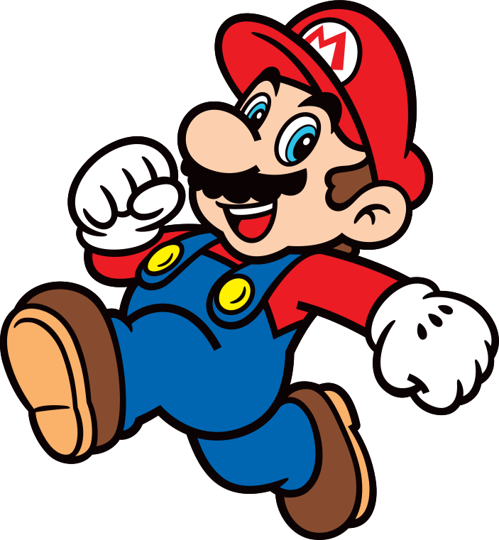

# В очередь…©

Немного об очередности работы метода `animate()`. Большинство читателей, наверное, уже знакомо с организацией последовательной анимации. Для этого мы можем использовать цепочку вызовов:

```javascript
// находим нужный элемент
$("#box")
  // указываем что хотим анимировать
  .animate({ left:"-=100" })
  // следующий вызов анимации добавляется в очередь на выполнение
  .animate({ top:"-=100" })
```

Для параллельного запуска анимации необходимо будет внести следующие изменения:

```javascript
// находим нужный элемент
$("#box")
  // указываем что хотим анимировать
  .animate({ left:"+=100" })
  // следующий вызов анимации будет игнорировать очередь
  .animate({ top:"+=100" }, { queue:false })
```


Хотя именно данный пример лучше записать как один вызов `animate()`:

```javascript
$("#box")
  .animate({
    left: "+=100",
    top: "+=100"
  })
```


Есть ещё чудесная функция `stop()`, которая позволяет остановить текущую анимацию на полпути, а также почистить очередь при необходимости. Для обеспечения различного поведения функции она принимает три параметра:

<table data-header-hidden><thead><tr><th width="275">параметр</th><th>назначение</th></tr></thead><tbody><tr><td><code>queue</code></td><td>имя очереди; <br>для работы с очередью анимации «<code>fx</code>» данный параметр опускаем («<code>fx</code>» – очередь по умолчанию)</td></tr><tr><td><code>clearQueue</code></td><td>флаг очистки очереди</td></tr><tr><td><code>jumpToEnd</code></td><td>применить результат анимации, али нет</td></tr></tbody></table>

Пример есть, и он требует ваших проб и ошибок:

```javascript
// очень медленный пример
$("#box")
  .animate({ left:"-=100" }, { duration: 10000 })
  .animate({ top: "-=100" }, { duration: 10000 })
```

```javascript
// останавливаем выполнение текущей анимации
$("#box").stop();
```

```javascript
// останавливаем выполнение текущей анимации
// и всех последующих (чистим очередь)
$("#box").stop(true);
```

```javascript
// останавливаем выполнение текущей анимации и всех последующих
// но применяем результат текущей
$('#box').stop(true, true);
```

```javascript
// останавливаем выполнение только текущей анимации
// и применяем её результат
$('#box').stop(false, true);
```

> Заметка на будущее: если вы сделали выпадающее меню, которое после игры с мышкой продолжает выпадать и исчезать, значит, надо вставить `stop()` в обработчик события.

Давайте попробуем на живом примере:



По умолчанию вся анимация над объектом складывается в очередь «`fx`», но с версии 1.7 можно указывать произвольную очередь:

```javascript
$("#box")
  .animate({ "top":"+=100" }, { duration: 10000, queue:"x" }) // составляем очередь X
  .dequeue("x") // запускаем очередь X
```

```javascript
$("#box").stop("x") // останавливаем анимацию в очереди X
```

Для чего нам может понадобиться произвольная очередь? Да для распараллеливания анимации, чтобы мы могли запустить одну очередь анимации и в любой другой момент запустить другую очередь. Возможно, это заклад под игры? Но чего гадать, давайте поиграем:



Откройте страницу и запустите скрипт — перед вами появится игровой персонаж, игра началась!

```javascript
$('#player').show()
```



Скрипт с обработчиком события `keydown` уже запущен, и вы можете заставить Марио бегать по странице используя «стрелочки» или клавиши `R`, `D`, `F` и `G`:

```javascript
var $player = $("#player");
$(document).keydown(function(event){
    // 37 - `←` | 68 - `d` | left
    // 38 - `↑` | 82 - `r` | up
    // 39 - `→` | 71 - `g` | right
    // 40 - `↓` | 70 - `f` | down
    switch (event.keyCode) {
        case 37:
        case 68:
            $player.stop("x", true);
            $player.animate({ "left":"-=100" }, { queue:"x" }).dequeue("x");
            break;
        case 38:
        case 82:
            $player.stop("y", true);
            $player.animate({ "top": "-=100" }, { queue:"y" }).dequeue("y");
            break;
        case 39:
        case 71:
            $player.stop("x", true);
            $player.animate({ "left":"+=100" }, { queue:"x" }).dequeue("x");
            break;
        case 40:
        case 70:
            $player.stop("y", true);
            $player.animate({ "top": "+=100" }, { queue:"y" }).dequeue("y");
            break;
    }
    event.stopImmediatePropagation();
})
```

В данном примере используется две очереди – `x` и `y`, которые соответствуют осям координат по которым мы осуществляем перемещение. При нажатии клавиши `←` происходит уменьшение значения `left` на `100px` в очереди `x`. При нажатии клавиши `→` мы очищаем очередь `x` и увеличиваем `left` на `100px`. Для перемещения по оси `y` мы используем одноименную очередь и клавиши `↑` и `↓`.

> Из данной главы вы должны были узнать, что у `WASD` раскладки есть альтернатива :)
>
> Все права на Марио принадлежат [Nintendo](https://www.nintendo.com/), так что будьте поаккуратней с ним.
