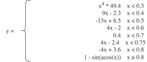
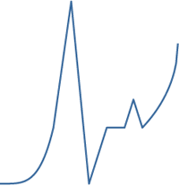
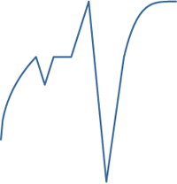
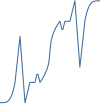

# Easing

Теперь опять обратимся к `easing` – приведу пример произвольной функции, которой будет следовать анимация. Дабы особо не фантазировать, я взял пример из статьи на когда-то популярном Хабре oб анимации в MooTools фреймворке – наглядный пример с сердцебиением, которое описывается следующими функциями:

<figure><figcaption></figcaption></figure>

В расширении функционала easing нет ничего военного:

```javascript
$.extend($.easing, {
    /**
     * Heart Beat
     *
     * @param {Float} x progress
     */
    heart:function(x) {
        if (x < 0.3) return Math.pow(x, 4) * 49.4;
        if (x < 0.4) return 9 * x - 2.3;
        if (x < 0.5) return -13 * x + 6.5;
        if (x < 0.6) return 4 * x - 2;
        if (x < 0.7) return 0.4;
        if (x < 0.75) return 4 * x - 2.4;
        if (x < 0.8) return -4 * x + 3.6;
        if (x >= 0.8) return 1 - Math.sin(Math.acos(x));
    }
});
```

Чуть-чуть пояснений, конструкция `$.extend({}, {})` «смешивает» объекты:

```javascript
$.extend({name:"Anton"}, {location:"Kharkiv"});
// >>>
{
  "name": "Anton",
  "location": "Kharkiv"
};

$.extend({name:"Anton", location:"Kharkiv"}, {location:"Kyiv"});
// >>>
{
  "name": "Anton",
  "location": "Kyiv"
}
```

Таким образом мы «вмешиваем» новый метод к существующему объекту `$.easing`; согласно коду, наш метод принимает в качестве параметра лишь одно значение:

`x` – коэффициент прохождения анимации, изменяется от 0 до 1, дробное

Результат, конечно, интересен, но его можно ещё чуть-чуть расширить дополнительными функциями (развернём и скомбинируем):

```javascript
jQuery.easing = {
    heartIn: function (x) {
        return $.easing.heart(x);
    },
    heartOut: function (x) {
        return $.easing.heart(1 - x);
    },
    heartInOut: function (x) {
        if (x < 0.5) return $.easing.heartIn(x);
        return $.easing.heartOut(x);
    }
}ж
```

Получим следующие производные функции:

|                 **heartIn**                |                 **heartOut**                 |                  **heartInOut**                  |
| :----------------------------------------: | :------------------------------------------: | :----------------------------------------------: |
|  |  |  |

Работать с данным творением надо следующим образом:

```javascript
$("#my").animate({height:"+200px"}, 2000, "heartIn"); // вот оно
```

Пример работы данной функции можно пощупать на соответствующей странице:


