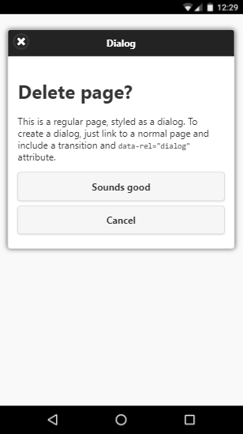
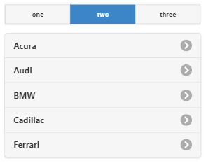
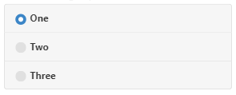

# jQuery Mobile

А вот это вполне самостоятельный продукт, и, как следует из названия, предназначен для создания интерфейсов для мобильных устройств с поддержкой «Touch Screen». Этот фреймворк хорошо документирован, с кучей примеров, которые можно пощупать на [http://jquerymobile.com/](http://jquerymobile.com/)

> _Данный фреймворк хорошо подходит для создания мобильных версий сайтов, но при этом он будет выглядеть как мобильное приложение. Точнее, сайт будет выглядеть как сайт на jQuery Mobile. Насколько это хорошо или плохо, мне судить сложно, скажем так – это востребовано._

Я не буду рассматривать все компоненты данного фреймворка, приведу лишь некоторые скриншоты (взяты с официального сайта [http://jquerymobile.com/](http://jquerymobile.com/)):

|  |    |
| -------------------------------------------------------------------- | ---------------------------------------------------------------------------------------------------------------------------------------- |

> _Для jQMobile существует свой собственный_ [_ThemeRoller_](http://jquerymobile.com/themeroller/)_._

И ещё советую обратить внимание на API данного фреймворка, без изучения оного вам будет затруднительно создать действительно интересные приложения.
