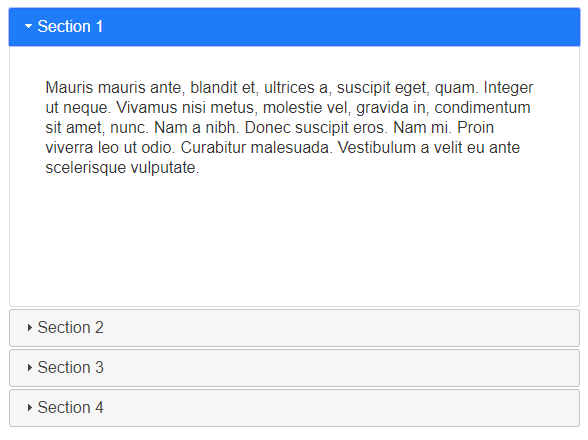
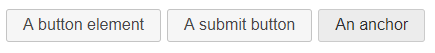
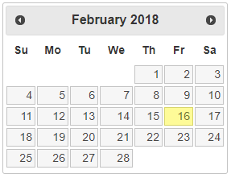
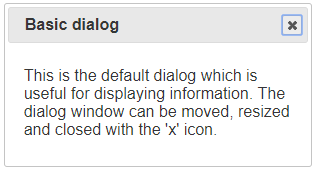
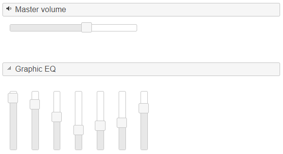
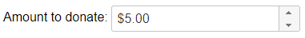
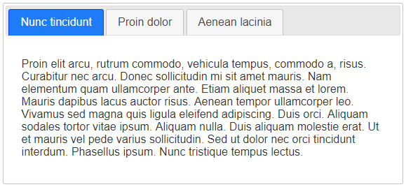
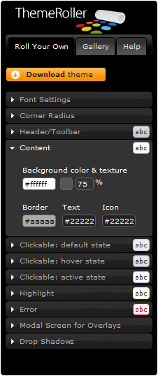

# jQuery UI

jQuery UI представляет из себя набор виджетов и плагинов от самих разработчиков jQuery. По моему мнению, данный инструмент необходимо изучить настолько, насколько это требуется, чтобы не писать свои «велосипеды». Скачать-почитать о данной надстройке над jQuery можно на домашней страницы проекта – [https://jqueryui.com/](https://jqueryui.com/).

Что нам необходимо знать о виджетах и плагинах? Первое – это какие они есть, и второе – как работают. На этих двух моментах я и постараюсь остановиться.

## Интерактивность

Начну с полезных плагинов, которые могут упростить жизнь при создании интерактивных интерфейсов:

* [Draggable](https://jqueryui.com/draggable/) – данный компонент позволяет сделать любой DOM-элемент перетаскиваемым при помощи мыши
* [Droppable](https://jqueryui.com/droppable/) – это логичное продолжение компонента Draggable; необходим для работы с контейнерами, внутрь которых можно перетаскивать элементы
* [Resizable](https://jqueryui.com/resizable/) – как следует из названия, даёт возможность растягивать любые DOM-элементы
* [Selectable](https://jqueryui.com/selectable/) – позволяет организовать «выбор» элементов; удобно использовать для организации менеджмента картинок
* [Sortable](https://jqueryui.com/sortable/) – сортировка DOM-элементов

## Виджеты

Виджеты – это уже комплексное решение, содержащее не только код JavaScript, но и некую реализацию HTML и CSS:

*   Accordion – данный виджет следует использовать, если у вас в проекте уже используется jQuery UI; сам по себе основной его функционал можно реализовать в несколько строк (посмотреть можно в [accordion.html](https://anton.shevchuk.name/book/code/accordion.html))

    
* Autocomplete – как и следует из названия, данный виджет отвечает за добавление функции автодополнения к полям ввода, естественно, с поддержкой AJAX
*   Button – создание кнопок с помощью JavaScript – ещё тот моветон, но, возможно, пригодится, если вы сильно завязались на jQuery UI:

    
*   Datepicker – если ваш браузер не поддерживает в полной мере спецификацию HTML 5 и `<input type="date"/>` в частности, то потребуется эмуляция данной возможности с помощью этого виджета: &#x20;

    
*   Dialog – виджет, предназначенный для создания слегка неуклюжих диалоговых окон:

    
* Menu – создание меню из списка, с поддержкой вложенности
*   Progressbar – название говорит само за себя, но в HTML 5 он тоже включён:

    
*   Slider – ещё один виджет для устаревших браузеров:

    
*   Spinner – ещё один удобный контрол для форм, опять же, в HTML 5 уже есть:

    
*   Tabs – они же табы, достаточно популярный элемент в web-разработке, и так же, как и «Accordion», вполне заменяем простым кодом (см. [tabs.html](http://anton.shevchuk.name/book/code/tabs.html)):

    
* Tooltip – вот и последний виджет, всплывающие подсказки; простой и должен быть востребован, ну а там жизнь покажет

На этом обзор виджетов можно считать законченным, вернёмся к плагинам.


Все виджеты и плагины завязаны на ядро jQuery UI, но есть также зависимости между самими плагинами и стоит о них помнить. Но не переживайте – при сборке jQuery UI пакета все зависимости проверяются автоматически, т.е. когда вам потребуется доселе неподключенный виджет, лучше скачать сборку заново.


## Утилиты

Утилит у нас не много – вот полезный плагин Position, который позволяет контролировать положение DOM-элементов – [https://jqueryui.com/position/](https://jqueryui.com/position/), а ещё есть фабрика по созданию виджетов, но о ней я расскажу чуть попозже.

## Эффекты

Среди эффектов, предоставляемых jQuery UI, я выделяю четыре пункта:

* Анимация цвета
* Анимация изменения классов
* Набор эффектов
* Расширение возможностей easing

За анимацию цвета отвечает компонент «Effects Core», который позволяет анимировать изменения цвета посредством использования метода `animate()`:

```javascript
$("#my").animate({ backgroundColor: "black" }, 1000);
```

Да-да, базовый jQuery не умеет этого делать, а вот jQuery UI позволяет анимировать следующие параметры:

* `backgroundColor`
* `borderBottomColor`
* `borderLeftColor`
* `borderRightColor`
* `borderTopColor`
* `color`
* `outlineColor`

Ещё одной возможностью, заключенной в «Effects Core» является анимация изменений класса DOM-элемента, т.е. когда вы будете присваивать новый класс элементу, то вместо обычного моментального применения новых CSS свойств вы будете наблюдать анимацию этих свойств от текущих до заданных в присваиваемом классе. Для использования данного функционала нам потребуются старые знакомые – методы `addClass()`, `toggleClass()` и `removeClass()`, с одной лишь разницей – при вызове метода вторым параметром должна быть указана скорость анимации:

```javascript
$("#my").addClass("active", 1000);

$("#my").toggleClass("active", 1000);

$("#my").removeClass("active", 1000);
```

Если из предыдущего абзаца у вас не возникло понимания сути происходящего, то этот код для вас:

```markup
<style>
#my {
    font-size:14px;
}
#my.active {
    font-size:20px;
}
</style>
<script>
$(function () {
    $("#my").addClass("active", 1000);
    // тут получается аналогично следующему вызову
    $("#my").animate({"font-size":"20px"}, 1000);
});
</script>
```

> А ещё появляется метод `switchClass()`, который заменяет один класс другим, но мне он ни разу не пригодился.

О наборе эффектов я не буду долго рассказывать, их лучше посмотреть в действии на странице [https://jqueryui.com/effect/](https://jqueryui.com/effect/). Для работы с эффектами появляется метод `effect()`, но сам по себе его лучше не использовать, ведь UI расширил функционал встроенных методов `show()`, `hide()` и `toggle()`. Теперь, передав в качестве параметра скорости анимации названия эффекта, вы получите необходимый результат:

```javascript
$("#my").hide("puff");

$("#my").show("transfer");

$("#my").toggle("explode");
```

> Приведу список эффектов, может, кто запомнит: `blind`, `bounce`, `clip`, `drop`, `explode`, `fold`, `highlight`, `puff`, `pulsate`, `scale`, `shake`, `size`, `slide`, `transfer`.

Помните, в главе об [анимации](../../40\_animation/) я рассказывал об easing и одноименном плагине для jQuery? Так вот, UI тоже расширяет easing, так что подключив UI, можно отключать плагин easing. И да, этот функционал завязан лишь на «Effects Core».

## Темы

Одной из самых замечательных особенностей jQuery UI является возможность менять «шкурки» всех виджетов разом, и для этого даже предусмотрена специальная утилита – [ThemeRoller](https://jqueryui.com/themeroller/):




Если в какой-то момент времени потребуется внести изменения в тему, откройте файл «jquery-ui-#.#.##-custom.css» и найдите строчку начинающуюся с текста «To view and modify this theme, visit http:...». Пройдите по указанной ссылке и, используя ThemeRoller, внесите необходимые изменения.

