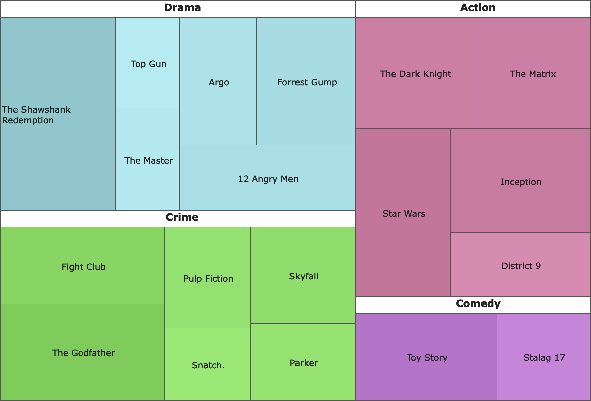

# jQWidgets

[jQWidgets](https://www.jqwidgets.com/) – это не просто библиотека, а целый комбайн с кучей полезных виджетов. Их на данный момент насчитывается более 60 штук, так что только привести список и скриншот на каждый – уже полкниги будет. Поэтому, обойдёмся кратеньким резюме к нескольким виджетам, надеюсь этого хватит, чтобы у вас разыгрался аппетит, и вы решились бы посмотреть на сайт разработчиков.

*   jqxGrid – это датагрид с кучей полезных и не очень примочек. Тут, понятное дело, есть постраничная навигация, сортировки, фильтрации и группировки. Только по этому виджету уже можно здоровенный талмуд написать:

    <figure><figcaption></figcaption></figure>
*   jqxChart – виджет для построения разнообразных графиков с помощью HTML, CSS и JavaScript, сделано всё очень и очень культурно, особенно выделю функцию по сохранению графика как картинки, иногда очень её не хватает:

    <figure><figcaption></figcaption></figure>
*   jqxGauge – этот виджет не часто встретишь и в более именитых фреймворках, но по сути – это некий измеритель, т.е. с его помощью можно нарисовать спидометр, манометр, термометр или иной измерительный прибор с произвольной шкалой:

    <figure><figcaption></figcaption></figure>
*   jqxTreeMap – ещё один редкий вид, скорее даже уникальный, с его помощью можно построить связанное дерево в виде организованных прямоугольников. Если ничего не понятно, то лучше посмотреть [демку](https://www.jqwidgets.com/jquery-widgets-demo/demos/jqxtreemap/index.htm#demos/jqxtreemap/defaultfunctionality.htm), ну и скриншот прилагаю:

    <figure><figcaption></figcaption></figure>
*   jqxTree – это уже не столь экзотический виджет; как понятно из названия, будем сажать деревья: &#x20;

    

На этом обзор «крутых» виджетов можно заканчивать, углубляться в скучные и обыденные обёртки над элементами форм мне не хочется. Замечу лишь, что во многом данный фреймворк обходит jQuery UI, но не всё так радужно в этом королевстве:


Данный фреймворк бесплатный лишь отчасти, у него конечно есть [Community лицензия](https://www.jqwidgets.com/license/), но по факту, вам таки надо будет раскошелиться, если вам нужны будут виджеты.


Ещё стоит упомянуть одну приятную особенность – возможность легкой интеграции с различными JavaScript-фреймворками. Но это уже другая история.
