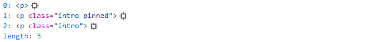

# Selectors

As I mentioned earlier, finding elements on the page is practically half the battle when working with jQuery. So let's get searching through the document.

### Identifiers and Classes

Selecting elements by `id` or class name, just like in CSS:

<table data-header-hidden><thead><tr><th width="303">selector</th><th></th></tr></thead><tbody><tr><td><code>$("#content")</code></td><td>select the element with <code>id="content"</code></td></tr><tr><td><code>$("section#content")</code></td><td>select the <code>&#x3C;section></code> with <code>id="content"</code></td></tr><tr><td><code>$(".intro")</code></td><td>select elements with <code>class="intro"</code></td></tr><tr><td><code>$(".intro.pinned")</code></td><td>select elements with both classes <code>intro</code> and <code>pinned</code></td></tr><tr><td><code>$("h3")</code></td><td>select all <code>&#x3C;h3></code> tags</td></tr><tr><td><code>$("h1, h2")</code></td><td>select all <code>&#x3C;h1></code> and <code>&#x3C;h2></code> tags</td></tr></tbody></table>


Use valid class names and identifiers


### Child Elements

Now let's remember that we're not alone in the DOM — it's a hierarchical structure after all:

<table data-header-hidden><thead><tr><th width="307">selector</th><th></th></tr></thead><tbody><tr><td><code>$("article h3")</code></td><td>select all <code>&#x3C;h3></code> tags inside the <code>&#x3C;article></code> tag</td></tr><tr><td><code>$("article").find("h3")</code></td><td>same as the example above</td></tr><tr><td><code>$("section article h3")</code></td><td>select all <code>&#x3C;h3></code> tags inside <code>&#x3C;article></code>, which are inside <code>&#x3C;section></code>, <em>in the DOM that Jack built</em></td></tr><tr><td><code>$("section")</code><br>  <code>.find("article")</code><br>  <code>.find("h3")</code></td><td>and once more, but in a different way — under the hood it works differently, but we'll talk about that later</td></tr></tbody></table>

### Sibling Elements

We have neighbors, and we've got a good connection with them. Here are a few ways to find them:

<table data-header-hidden><thead><tr><th width="309">selector</th><th></th></tr></thead><tbody><tr><td><code>$("article + article")</code></td><td>select all <code>&#x3C;article></code> elements preceded by an <code>&#x3C;article></code> tag</td></tr><tr><td><code>$("#stick ~ article")</code></td><td>select all <code>&#x3C;article></code> elements after the element with <code>id="stick"</code></td></tr><tr><td><code>$("#stick").next()</code></td><td>select the next element after the element with <code>id="stick"</code></td></tr></tbody></table>

### Descendants and Parents

Family ties matter:

<table data-header-hidden><thead><tr><th width="306">selector</th><th></th></tr></thead><tbody><tr><td><code>$("article > h3")</code></td><td>select all <code>&#x3C;h3></code> tags that are direct descendants of the <code>&#x3C;article></code> tag</td></tr><tr><td><code>$("article > *")</code></td><td>select all descendants of <code>&#x3C;article></code> elements</td></tr><tr><td><code>$("article").children()</code></td><td>same as the example above</td></tr><tr><td><code>$("p").parent()</code></td><td>select all direct parents of <code>&#x3C;p></code> elements</td></tr><tr><td><code>$("p").parents()</code></td><td>select all ancestors of <code>&#x3C;p></code> elements<br>quite an exotic task</td></tr><tr><td><code>$("p").parents("section")</code></td><td>select all ancestors of <code>&#x3C;p></code> elements that are <code>&#x3C;section></code> (<code>parents()</code> accepts a selector as a parameter)</td></tr></tbody></table>


`$("*")` – select all elements; use with extreme caution


### Searching by Attributes

Back in the CSS2 days there was already the ability to find elements with specific attributes, and [CSS3](https://www.w3.org/TR/selectors-3/) expanded the capabilities of [attribute selectors](https://www.w3.org/TR/selectors-3/#attribute-selectors):

<table data-header-hidden><thead><tr><th width="306">selector</th><th></th></tr></thead><tbody><tr><td><code>$("a[href]")</code></td><td>all links with an <code>href</code> attribute</td></tr><tr><td><code>$("a[href=#]")</code></td><td>all links with <code>href=#</code></td></tr><tr><td><code>$("a[href~=#]")</code></td><td>all links where <code>#</code> is one of the words in <code>href</code></td></tr><tr><td><code>$("a[hreflang|=en]")</code></td><td><p>all links with the word <code>en</code> in <code>hreflang</code> </p><p>the <code>-</code> character is treated as a word separator:  <code>en</code>, <code>en-US</code>, <code>en-UK</code></p></td></tr><tr><td><code>$("a[href^=https]")</code></td><td>links starting with <code>https</code></td></tr><tr><td><code>$("a[href*='google.com']")</code></td><td>links to "google it"</td></tr><tr><td><code>$("a[href$=.pdf]")</code></td><td>links to PDF files (in theory)</td></tr></tbody></table>


If you decide to peek inside jQuery, you'll most likely find the very place where your expression is being parsed using regular expressions. For this reason, you need to escape special characters in selectors using a double backslash "`\\`":

```javascript
$("a[href^=\\/]").addClass("internal");
```


### Structural Pseudo-classes

I'd also like to draw your attention to the [structural pseudo-classes](https://www.w3.org/TR/selectors-3/#structural-pseudos) from the [CSS3](https://www.w3.org/TR/selectors-3/) specification — there are lots of interesting and useful ones, for example:

<table data-header-hidden><thead><tr><th width="321">selector</th><th></th></tr></thead><tbody><tr><td><code>$("ul li:first-child")</code></td><td>first child element</td></tr><tr><td><code>$("ul li:last-child")</code></td><td>last child element</td></tr><tr><td><code>$("ul li:nth-child(2n+1)")</code></td><td><p>selecting elements by a simple equation </p><p>you can read more in the article "<a href="https://web-standards.ru/articles/nth-child/">How nth-child works</a>"</p></td></tr></tbody></table>

### Negation Pseudo-class

The negation pseudo-class `:not()` is one of a kind — it lets you select all elements that don't match the nested selection in the parentheses

<table data-header-hidden><thead><tr><th width="321">selector</th><th></th></tr></thead><tbody><tr><td><code>$("a:not(.active)")</code></td><td>all <code>&#x3C;a></code> links without the <code>active</code> class</td></tr><tr><td><code>$("a").not(".active")</code></td><td>same result, using the <code>.not()</code> method</td></tr></tbody></table>

> If you want to play around with selectors to your heart's content, open the page [css.selectors.html](https://anton.shevchuk.name/book/code/css.selectors.html) in a new tab, and there you can practice writing selectors using the menu on the right

### The "Election" Results

When using the queries listed above you've found (or haven't found) DOM elements, a jQuery object will be returned containing an array of those elements. Here's what it looks like for the query

:



You may have noticed the `length` property. Yep, that's right — it's the number of found elements. So we can easily get that number with the following code:

```javascript
alert( $("p").length )
```

If you need to extract a found DOM element, you can do it by knowing its index. Essentially, it looks like accessing an array element:

```javascript
// we search for all paragraphs
// take the first one
// get the paragraph's text
// return the text length
alert( $("p")[0].innerText.length )
```

If you don't like this approach for aesthetic reasons, you can use the `.get()` method:

```javascript
alert( $("p").get(0).innerText.length )
```
