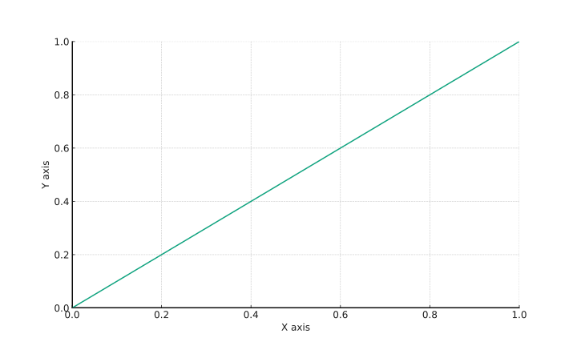
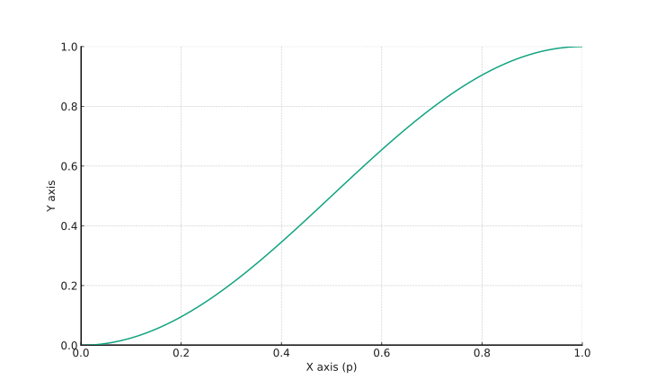

# Easing Functions

Alright, enough playing around — time to make your life a bit more complicated. The `animate()` method can take more than one argument, and it's time we broke them down. The argument set can vary; here's the first one, the simpler one:

<table data-header-hidden><thead><tr><th width="243">parameter</th><th>purpose</th></tr></thead><tbody><tr><td><code>properties</code></td><td>CSS properties — we've already covered this</td></tr><tr><td><code>duration</code></td><td>animation speed, mentioned before — specified in milliseconds, or using the keywords "<code>fast</code>" or "<code>slow</code>"</td></tr><tr><td><code>easing</code></td><td>specifies which function to use for changing values</td></tr><tr><td><code>complete</code></td><td>function that will be called after the animation ends</td></tr></tbody></table>

Of the listed parameters, only "`easing`" hasn't come up before — I was saving it for this moment. This parameter specifies which function will be used for the value animation process. These can be linear, quadratic, cubic, or any other functions. Out of the box, we can only choose between "`linear`":

<figure><figcaption><p>linear</p></figcaption></figure>

and "`swing`":

<figure><figcaption><p>swing</p></figcaption></figure>

If you peek into the jQuery source code, you'll easily find the corresponding code:

```javascript
jQuery.easing = {
    linear: function( p ) {
        return p;
    },
    swing: function( p ) {
        return 0.5 - Math.cos( p * Math.PI ) / 2;
    },
    _default: "swing"
};
```


`p` — the animation progress coefficient, changes from 0 to 1.


Want more easing functions? Then check out the easing plugin at [https://gsgd.co.uk/sandbox/jquery/easing/](https://gsgd.co.uk/sandbox/jquery/easing/) — it's truly a "must have".



> As a guide to easing functions, you can use the page [https://easings.net/](https://easings.net/).

I'll tell you how to write your own animation function a bit later.
