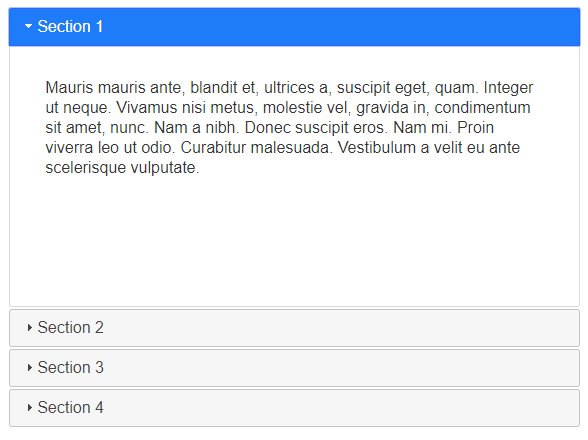
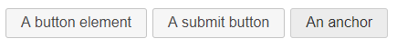
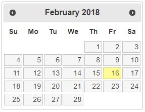
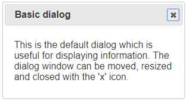
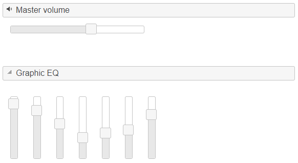
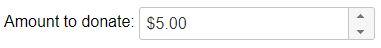
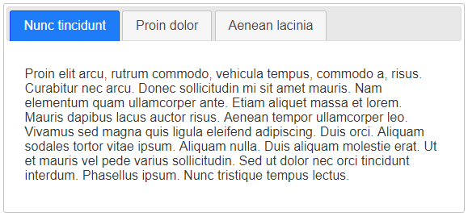
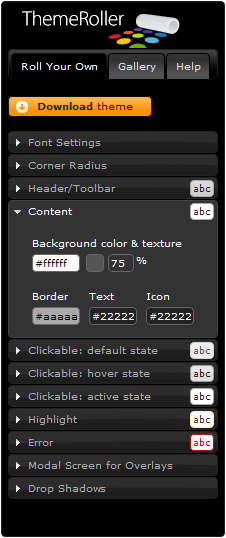

# jQuery UI

jQuery UI is a collection of widgets and plugins from the jQuery developers themselves. In my opinion, you should learn this tool just enough to avoid reinventing the wheel. You can download and read about this jQuery add-on on the project's home page — [https://jqueryui.com/](https://jqueryui.com/).

What do we need to know about widgets and plugins? First — what they are, and second — how they work. These are the two points I'll try to focus on.

## Interactivity

I'll start with useful plugins that can simplify your life when creating interactive interfaces:

* [Draggable](https://jqueryui.com/draggable/) — this component lets you make any DOM element draggable with the mouse
* [Droppable](https://jqueryui.com/droppable/) — the logical continuation of the Draggable component; needed for working with containers that elements can be dragged into
* [Resizable](https://jqueryui.com/resizable/) — as the name suggests, it lets you resize any DOM elements
* [Selectable](https://jqueryui.com/selectable/) — lets you organize element "selection"; convenient for image management
* [Sortable](https://jqueryui.com/sortable/) — sorting of DOM elements

## Widgets

Widgets are comprehensive solutions that include not only JavaScript code, but also some HTML and CSS implementation:

*   Accordion — use this widget if your project already uses jQuery UI; its core functionality can be implemented in just a few lines (check out [accordion.html](https://anton.shevchuk.name/book/code/accordion.html))

    
* Autocomplete — as the name implies, this widget adds autocomplete functionality to input fields, naturally with AJAX support
*   Button — creating buttons with JavaScript is quite the faux pas, but it might come in handy if you're heavily invested in jQuery UI:

    
*   Datepicker — if your browser doesn't fully support the HTML 5 specification, and `<input type="date"/>` in particular, you'll need to emulate this capability with this widget: &#x20;

    
*   Dialog — a widget designed for creating slightly clunky dialog windows:

    
* Menu — creating menus from lists, with nesting support
*   Progressbar — the name speaks for itself, though HTML 5 includes one too:

    
*   Slider — another widget for outdated browsers:

    
*   Spinner — another handy form control, which, again, already exists in HTML 5:

    
*   Tabs — a pretty popular element in web development, and just like "Accordion", can be easily replaced with simple code (see [tabs.html](https://anton.shevchuk.name/book/code/tabs.html)):

    
* Tooltip — and the last widget, tooltips; simple and should be in demand, but time will tell

That wraps up the widget overview, let's get back to plugins.


All widgets and plugins depend on the jQuery UI core, but there are also dependencies between the plugins themselves, and it's worth keeping that in mind. But don't worry — when building a jQuery UI package, all dependencies are checked automatically, so when you need a previously unincluded widget, it's best to download a fresh build.


## Utilities

We don't have many utilities — here's the useful Position plugin, which lets you control the position of DOM elements — [https://jqueryui.com/position/](https://jqueryui.com/position/), and there's also a widget factory, but I'll tell you about that a bit later.

## Effects

Among the effects provided by jQuery UI, I highlight four items:

* Color animation
* Class change animation
* Effect set
* Extended easing capabilities

The "Effects Core" component handles color animation, allowing you to animate color changes using the `animate()` method:

```javascript
$("#my").animate({ backgroundColor: "black" }, 1000);
```

Yep, basic jQuery can't do this, but jQuery UI lets you animate the following properties:

* `backgroundColor`
* `borderBottomColor`
* `borderLeftColor`
* `borderRightColor`
* `borderTopColor`
* `color`
* `outlineColor`

Another capability built into "Effects Core" is animating class changes on a DOM element — meaning when you assign a new class to an element, instead of the usual instant application of new CSS properties, you'll see those properties animate from current values to those defined in the assigned class. To use this functionality, we'll need our old friends — the `addClass()`, `toggleClass()`, and `removeClass()` methods, with one difference — the second parameter when calling the method should be the animation speed:

```javascript
$("#my").addClass("active", 1000);

$("#my").toggleClass("active", 1000);

$("#my").removeClass("active", 1000);
```

If the previous paragraph didn't quite click, this code is for you:

```markup
<style>
#my {
    font-size:14px;
}
#my.active {
    font-size:20px;
}
</style>
<script>
$(function () {
    $("#my").addClass("active", 1000);
    // this is essentially the same as the following call
    $("#my").animate({"font-size":"20px"}, 1000);
});
</script>
```

> There's also a `switchClass()` method that replaces one class with another, but I've never needed it.

I won't go on at length about the effects set — they're better seen in action at [https://jqueryui.com/effect/](https://jqueryui.com/effect/). There's an `effect()` method for working with effects, but it's better not to use it on its own, since UI extended the functionality of the built-in `show()`, `hide()`, and `toggle()` methods. Now, by passing an effect name as the animation speed parameter, you'll get the desired result:

```javascript
$("#my").hide("puff");

$("#my").show("transfer");

$("#my").toggle("explode");
```

> Here's the list of effects, maybe someone will remember them: `blind`, `bounce`, `clip`, `drop`, `explode`, `fold`, `highlight`, `puff`, `pulsate`, `scale`, `shake`, `size`, `slide`, `transfer`.

Remember, in the chapter on [animation](../../40\_animation/) I talked about easing and the jQuery plugin of the same name? Well, UI also extends easing, so once you include UI, you can drop the easing plugin. And yes, this functionality is tied only to "Effects Core".

## Themes

One of the most wonderful features of jQuery UI is the ability to change the "skin" of all widgets at once, and there's even a special utility for this — [ThemeRoller](https://jqueryui.com/themeroller/):




If at some point you need to make changes to the theme, open the "jquery-ui-#.#.##-custom.css" file and find the line starting with "To view and modify this theme, visit http:...". Follow that link and, using ThemeRoller, make the necessary changes.

