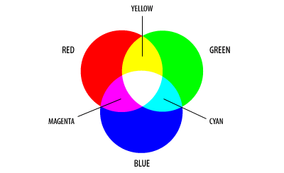
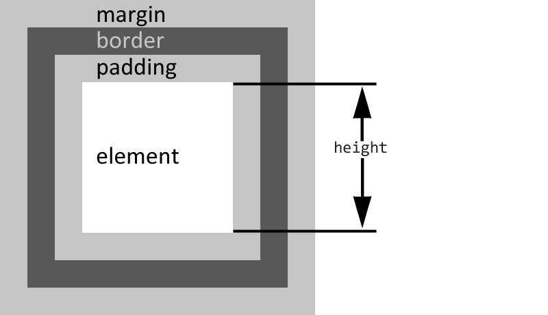
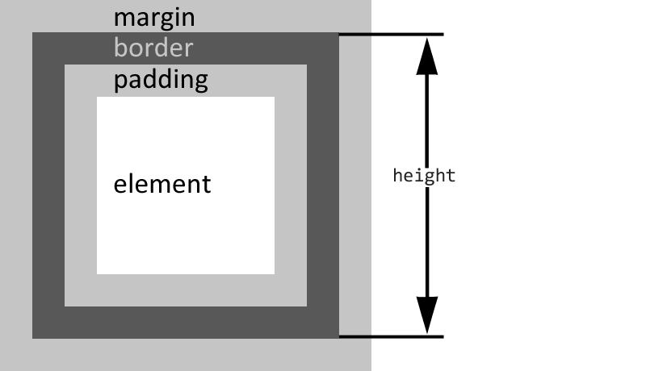

# CSS. Занурення

## Про форматування <a href="#codestyle" id="codestyle"></a>

Ні, я не владний над собою, і таки наведу як приклад CSS-форматування, яке я використовую:

```css
/* Header */
header {
    margin-bottom: 16px;
    font-weight: 400;
}

header h1 {
    color: #999;
}

header p {
    font-size: 1.4em;
    margin-top: 0;
}
/* /Header */
```

Чому це добре:

* такий CSS легко читається
* є ідентифікатор початку блоку (можна швидко знайти необхідну частину навіть у дуже великому CSS-файлі використовуючи пошук за міткою `* header`)
* подібне форматування явно вказує на вкладеність елементів
* і можна легко прослідкувати наслідування властивостей

Я не наполягаю на своєму варіанті, але хотілось би, щоб ти взяв на озброєння один із багатьох стандартів форматування і завжди слідував йому.

> Коли станеш матьорим front-end розробником — пізнаєш всю силу CSS-препроцесорів, а поки слухай і запам'ятовуй.

Це візуальне ускладнення призначене для людей; для браузерів воно не відіграє жодної ролі, оскільки вони все одно при роботі зі стилями проводять конкатенацію, тобто видаляють переноси рядків, відступи, коментарі, некритичні пробіли. Деякі типи web-серверів, наприклад, для банківських тонких клієнтів, проводять стиснення (і архівацію) файлів ще до пересилки до місця використання, з економії трафіку та грошей.

## Іменування класів та ідентифікаторів <a href="#naming-convention" id="naming-convention"></a>

Я вже торкався цієї теми, коли розповідав про релевантність HTML, так ось — імена класів можуть бути навіть такими: `b-service-list__column b-service-list__column_right` і це буде круто, і «must have» — але лише в рамках дійсно великих проєктів. Власне, чого я розпинаюсь? Дам для вивчення [вихідну точку](https://ru.bem.info/methodology/), інформації там — ще на одну книгу ;)


Рекомендую ознайомитись із [принципами БЕМ](https://ru.bem.info/methodology/) — це корисно для розширення кругозору та прокачки скілів.


## Про кольори <a href="#css-colors" id="css-colors"></a>

В WEB використовується колірна модель [RGB](https://www.w3.org/TR/css-color-3/#rgb-color), що іменується за англійськими назвами «несучих» колірних каналів — red, green, blue — яка спирається на цифрове позначення для будь-яких відтінків. Тому червоний колір можна записати не тільки як «red», але й ще декількома способами:

```css
p { color: red }

p { color: #ff0000 }

p { color: #f00 }   /* скорочений запис, економить 3 байти */

p { color: rgb(255, 0, 0) }
```

> Тепер ти без запинки маєш назвати кольори `#f00`, `#0f0`, `#00f`, а ті, у кого з малювання було «відмінно», назвуть і `#ff0`, `#0ff` та `#f0f` ;)

В CSS 3 підтримується вдосконалена модель [RGBA](https://www.w3.org/TR/css-color-3/#rgba-color), де ми додатково можемо задати значення α-каналу, тобто прозорість:

```css
p { color: rgba(255, 0, 0, 1) }   /* звичайний текст */

p { color: rgba(255, 0, 0, 0.5) } /* напівпрозорий текст */
```

Ще одна фішка CSS 3 — це можливість використання колірних моделей [HSL](https://www.w3.org/TR/css-color-3/#hsl-color) (hue, saturation, lightness — відтінок, насиченість і яскравість; вимовляється як «хью, сатурейшн, лайтнесс») та [HSLA](https://www.w3.org/TR/css-color-3/#hsla-color) (HSL + α-канал):

```css
p { color: hsl( 0, 100%, 50%) }   /* червоний */

p { color: hsl(120, 100%, 50%) }  /* зелений */

p { color: hsl(240, 100%, 50%) }  /* синій */

p { color: hsla( 0, 100%, 50%, 0.5) } /* напівпрозорий червоний */
```

Для переведення з моделі HSL в модель RGB існує простий алгоритм, але поки що не варто ним себе вантажити.

> Та хто тим HSL користується? ~~Не морочте собі голову!~~ HSL стає все більш популярним, і ти маєш про нього знати, і навіть розуміти, як він працює!

Тим, кого питання зі змішуванням каналів RGB поставило в глухий кут, наочний посібник:



## Блокові та рядкові елементи <a href="#block-and-inline" id="block-and-inline"></a>

Можливо, ти ще не знаєш, але HTML-теги поділяються на блокові (block-тип) та рядкові (inline-тип). Блоковими елементами називають ті, які відображаються як прямокутник, займають усю доступну ширину всередині елемента-батька, і їх висота визначається їх змістом. Блокові теги за замовчуванням починаються і закінчуються новим рядком — це `<div>`, `<h1>` та побратими, `<p>` та інші.

Якщо хочеш, щоб твій HTML залишався валідним, слідкуй за тим, щоб блокові елементи не розташовувались усередині рядкових елементів. Усередині рядкових тегів може бути або текст, або інші рядкові елементи.

> Одна з помилок, які я часто зустрічаю, це коли в параграф `<p>` намагаються закидати якщо не список `<ul>`, то кнопку `<button>`.  Не треба так.&#x20;

Корисні статті з теми:

* [Inline Elements List and What's New in HTML5](https://www.tutorialchip.com/tutorials/inline-elements-list-whats-new-in-html5/)
* [HTML5 Block Level Elements: Complete List](https://www.tutorialchip.com/tutorials/html5-block-level-elements-complete-list/)
* [Блочная модель](https://doka.guide/css/box-model/)
* [Раскладка в CSS: поток](https://softwaremaniacs.org/blog/2005/08/27/css-layout-flow/)

## Про розміри блокових елементів <a href="#size" id="size"></a>

Ще хотів окремо зупинитися на обчисленні ширини та висоти блокових елементів, адже тут є один нюанс. За замовчуванням висота та ширина елементів вважаються без урахування товщини границь та внутрішніх відступів, тобто якось так:



Ця блокова модель називається «content-box», і ось в CSS3 з'явилася можливість змінювати блокову модель, указуючи властивість «box-sizing». Чудово, тепер ми можемо обирати між двома значеннями «content-box» та «border-box». Перше я вже описав, а ось друге обчислює висоту та ширину, уключаючи внутрішні відступи та товщину границь:



Корисні статті з теми:

* [Блочные элементы](https://htmlbook.ru/content/blochnye-elementy)
* [Встроенные элементы](https://htmlbook.ru/content/vstroennye-elementy)

## Плаваючі елементи <a href="#float" id="float"></a>

Я б хотів ще розповісти про CSS-властивість `float`, але боюся, розповідь буде довгою і виснажливою. Коротенько: якщо ти вказуєш елементу властивість `float`, то:

* наш елемент буде зміщений по горизонталі та «прилипне» до вказаного краю батьківського елемента
* якщо це був блоковий елемент, то тепер він не буде займати всю ширину батьківського елемента та звільнить місце
* якщо слідом ідуть блокові елементи, то вони займуть його місце
* якщо слідом ідуть рядкові елементи, то вони будуть обтікати наш елемент з вільного боку

Це поведінка «за замовчуванням», а як це виглядає наживо можна подивитися на прикладі [css.float.html](https://anton.shevchuk.name/book/code/css.float.html).

Тут головне розуміти, що відбувається і вміти керувати, якщо, звісно, ти хочеш хоч трішки навчитись верстати :)


Розуміння роботи `float` в CSS — одна з багатьох навичок, якими має володіти верстальник. Для загального ознайомлення рекомендую статтю «[Раскладка в CSS: float](https://softwaremaniacs.org/blog/2005/12/01/css-layout-float/)»


## Позиціонування <a href="#position" id="position"></a>

Дам лише вступну по `position`. У нього є п'ять основних значень:

* `static` — стан справ «за замовчуванням», елементи розташовуються в нормальному потоці документа один за одним зверху вниз
* `absolute` — елемент позиціонується відносно найближчого позиціонованого предка (не `static`), згідно з вказаними координатами
* `fixed` — елемент фіксується на певному місці у вікні перегляду, не переміщуючись при прокрутці сторінки
* `relative` — елемент поводиться як `static`, але його можна змістити відносно його звичайного положення, також слугує контекстом для позиціювання внутрішніх «абсолютних» елементів
* `sticky` — елемент "приклеюється" до певного місця у вікні перегляду при прокрутці сторінки до досягнення заданого порогу, працюючи як поєднання `relative` та `fixed`


Для самостійного вивчення:

— [Раскладка в CSS: позиционирование](https://softwaremaniacs.org/blog/2005/08/03/css-layout-positioning/) — трохи застаріла стаття, але все ж вона тут

— [CSS-position](https://developer.mozilla.org/ru/docs/Web/CSS/position) — мануали на dev.mozilla.org завжди актуальні, не завжди з перекладом

— [Дока-справочник по CSS](https://doka.guide/css/) — багато всього про CSS, зрозумілою мовою

