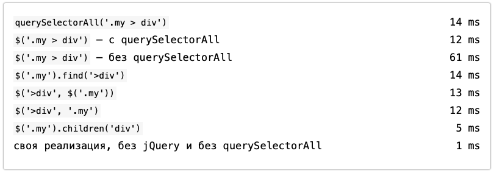
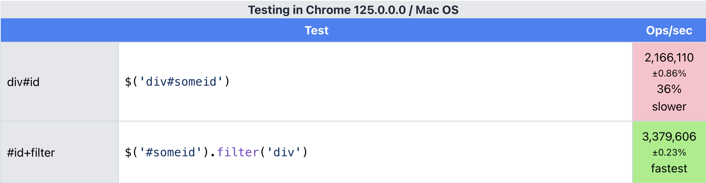
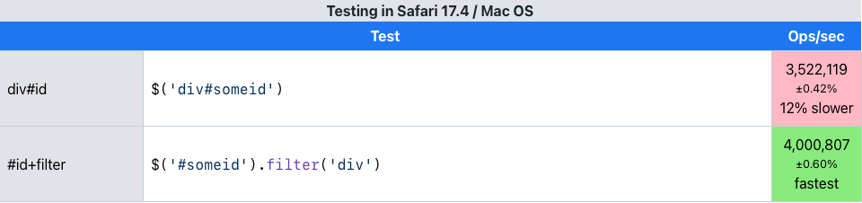

# Оптимізація


Ну, перш за все, вам слід запам'ятати, що&#x20;

**результати пошуку не кешуються — щоразу, запитуючи елементи за селектором, ви ініціюєте пошук елементів знову і знову**


При ознайомленні з алгоритмом роботи Sizzle, одразу напрошується кілька порад щодо оптимізації роботи з вибірками:

* Зберігати результати пошуку (виходячи з постулату вище):

```javascript
// було
$("a.button").addClass("active");
/* ... */
$("a.button").click(function(){ /* ... */ });

// стало
var $button = $("a.button");
$button.addClass("active");
/* ... .*/
$button.click(function(){ /* ... */ });
```

> Правильна IDE про подібні речі знає, і буде вам час від часу підказувати ;)

* Використовувати ланцюжки викликів (що по суті аналогічно першому правилу):

```javascript
// було
$("a.button").addClass("active");
$("a.button").click(function(){ /* ... */ });

// стало
$("a.button")
  .addClass("active")
  .click(function(){ /* ... */ });
```

* Використовувати `context` (це такий другий параметр при виборі за селектором):

```javascript
// було
$(".content a.button");

// стало
$("a.button", ".content");

// ще варіант, не швидше, але читабельність вища
$(".content").find("a.button");
```

* Розбивати запит на простіші складові частини, використовуючи `context`, і зберігати проміжні дані:

```javascript
// було
$(".content a.button");
$(".content h3.title");

// стало
let $content = $(".content")
$content.find("a.button");
$content.find("h3.title");
```

* Використовувати більш «їстівні» селектори, аби допомогти методу `.querySelectorAll()`, тобто якщо у вас немає впевненості у правильності написання селектора, або ви сумніваєтеся в тому, що всі браузери підтримують необхідний CSS-селектор, то краще розділити «складний» селектор на кілька простіших:

```javascript
// було
$(".content div input:disabled");

// стало
$(".content div").find("input:disabled");
```

* Не використовувати jQuery, а працювати з «native» функціями JavaScript

> Є ще один пункт – обирати найшвидший селектор з можливих, але тут без доброго багажу знань не обійтися, тож дерзайте, пробуйте і надсилайте ваші приклади.

Для наочності найкраще поглянути на порівняльний тест [benchmark.html](https://anton.shevchuk.name/book/code/benchmark.html):

<figure><figcaption></figcaption></figure>

> Цей тест виконує пошук елементів кількома способами і був спочатку розроблений Іллею Кантором для майстер-класу з JavaScript та jQuery


Маленька хитрість від творців jQuery – запити по id елемента не доходять до Sizzle, а згодовуються `document.getElementById()` як параметр:


```javascript
$("#content");
// -> 
document.getElementById("content");
```



## Приклади оптимізацій

Вибір за ідентифікатором елемента — найшвидший з можливих, намагайтеся використовувати його якщо є така можливість:

```javascript
// всередині одна регулярочка + getElementById()
$("#content");

// ось так ще швидше
// економія незначна, а зручність використання прямує до нуля
$(document.getElementById("content"));
```

Селектор `div#content` працює на порядок повільніше, ніж пошук лише за ідентифікатором `#content`, але й він має право на існування у випадку, якщо ваш скрипт використовується на кількох сторінках, а логіка вимагає лише обробляти поведінку для елемента `<div>`. Цей селектор можна представити у двох варіантах:

```javascript
// getElementById() + фільтрація
$("#content").filter("div");

// залишаємо як є і сподіваємося на QuerySelectorAll()
$("div#content");
```

Але й тут є різниця у продуктивності, у результаті [тестування](https://jsperf.app/biwafe) отримуємо, що приклад з використанням `.filter()` працює швидше на 20-30%:



<figure><figcaption><p>Testing in Chrome</p></figcaption></figure>



<figure><figcaption><p>Testing in Safari</p></figcaption></figure>



Але все ж, подібна тонка оптимізація потрібна далеко не завжди. \
Висновки робимо самі.
