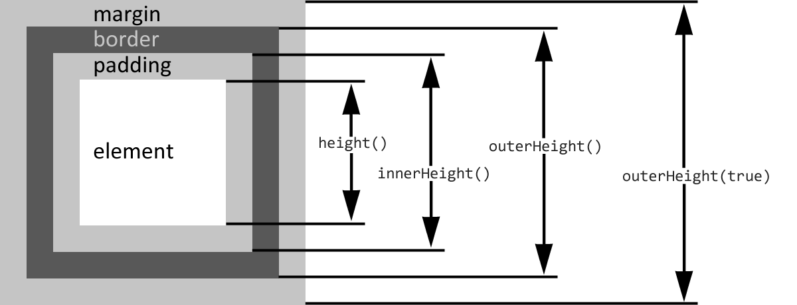

# Розміри

Переварили попередній розділ? Добре, тепер настала черга методів, які працюють з розмірами елементів.


Але перш ніж продовжити, рекомендую освіжити в пам'яті інформацію про [обчислення висоти та ширини блокових елементів](../0\_html\_css\_javascript/advanced-css.md#size) ;)


<table data-header-hidden><thead><tr><th width="323">метод</th><th>опис</th></tr></thead><tbody><tr><td><pre class="language-javascript"><code class="lang-javascript">height()
</code></pre></td><td>повертає висоту елемента за вирахуванням відступів та меж; <br><br>якщо у нас кілька елементів у вибірці, то повернеться перший; <br><br>значення, на відміну від методу <code>css("height")</code>, повертається без зазначення одиниць виміру</td></tr><tr><td><pre class="language-javascript"><code class="lang-javascript">height(height)
</code></pre></td><td><p></p><p>встановлює висоту всіх елементів у вибірці; <br><br>якщо значення висоти передано без зазначення одиниць виміру, то це будуть пікселі <code>px</code></p></td></tr></tbody></table>


Нагадування з мануалу

```javascript
$(window).height();   // висота вікна
$(document).height(); // висота HTML документа
```


Методи `width()` та `width(width)` – поводяться аналогічно до методу `height()`, але працюють з шириною елемента:

<table data-header-hidden><thead><tr><th width="323">метод</th><th>опис</th></tr></thead><tbody><tr><td><pre class="language-javascript"><code class="lang-javascript">width()
</code></pre></td><td>повертає ширину елемента за вирахуванням відступів та меж; <br><br>якщо у нас кілька елементів у вибірці, то повернеться перший; <br><br>значення повертається без зазначення одиниць виміру</td></tr><tr><td><pre class="language-javascript"><code class="lang-javascript">width(width)
</code></pre></td><td><p></p><p>встановлює ширину всіх елементів у вибірці; <br><br>якщо значення ширини передано без зазначення одиниць виміру, то це будуть пікселі <code>px</code></p></td></tr></tbody></table>


Методи `height()` та `width()` **не змінюють** своєї поведінки залежно від обраної блокової моделі, тобто вони завжди повертають параметри області всередині `margin`, `padding` та `border` елемента.


<table data-header-hidden><thead><tr><th width="323">метод</th><th>опис</th></tr></thead><tbody><tr><td><pre class="language-javascript"><code class="lang-javascript">innerHeight()
innerWidth()
</code></pre></td><td>повертають, відповідно, висоту та ширину елемента, включаючи <code>padding</code></td></tr><tr><td><pre class="language-javascript"><code class="lang-javascript">outerHeight()
outerWidth()
</code></pre></td><td>повертають висоту та ширину елемента, включаючи <code>padding</code> та <code>border</code></td></tr><tr><td><pre class="language-javascript"><code class="lang-javascript">outerHeight(true)
outerWidth(true)
</code></pre></td><td>повертають висоту та ширину елемента, включаючи <code>padding</code>, <code>border</code> та <code>margin</code></td></tr></tbody></table>

Для наочності відмінностей між методами `height()`, `innerHeight()` та `outerHeight()` я створив наступний приклад:



У цьому прикладі для центрального елемента з `id=block` задані наступні стилі:

```css
#block {
  height: 40px;
  margin: 40px;
  padding: 40px;
  border: 40px solid #777;
}
```

Тепер подивимося на те, що буде повертати кожна з перелічених функцій:

```javascript
alert(`
  height()          = ${$("#block").height()}
  innerHeight()     = ${$("#block").innerHeight()}
  outerHeight()     = ${$("#block").outerHeight()}
  outerHeight(true) = ${$("#block").outerHeight(true)}
`);
```

Щоб легше зрозуміти те, що відбувається, я ще трохи заморочивсь і переробив кілька картинок з офіційної документації в одну повноцінну ілюстрацію:



