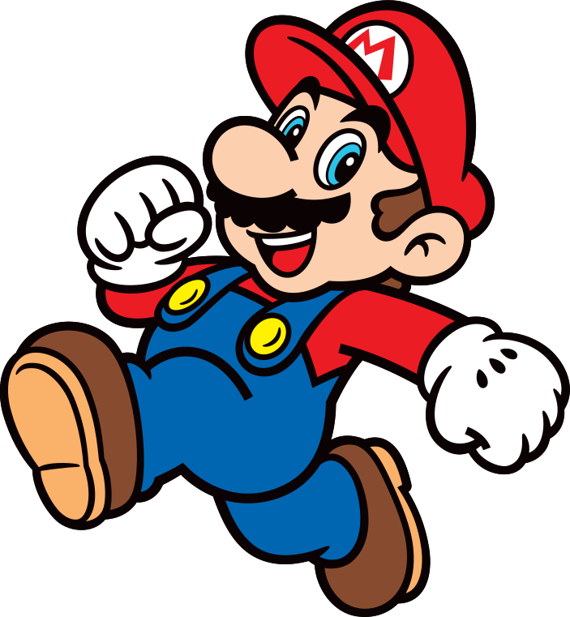

# В чергу...©

Трохи про черговість роботи методу `animate()`. Більшість читачів, мабуть, вже знайомі з організацією послідовної анімації. Для цього ми можемо використати ланцюжок викликів:

```javascript
// знаходимо потрібний елемент
$("#box")
  // вказуємо що хочемо анімувати
  .animate({ left:"-=100" })
  // наступний виклик анімації додається в чергу на виконання
  .animate({ top:"-=100" })
```

Для паралельного запуску анімації необхідно буде внести наступні зміни:

```javascript
// знаходимо потрібний елемент
$("#box")
  // вказуємо що хочемо анімувати
  .animate({ left:"+=100" })
  // наступний виклик анімації буде ігнорувати чергу
  .animate({ top:"+=100" }, { queue:false })
```


Хоча саме даний приклад краще записати як один виклик `animate()`:

```javascript
$("#box")
  .animate({
    left: "+=100",
    top: "+=100"
  })
```


Є ще чудова функція `stop()`, яка дозволяє зупинити поточну анімацію на півдорозі, а також почистити чергу за потреби. Для забезпечення різної поведінки функції вона приймає три параметри:

<table data-header-hidden><thead><tr><th width="275">параметр</th><th>призначення</th></tr></thead><tbody><tr><td><code>queue</code></td><td>ім'я черги; <br>для роботи з чергою анімації «<code>fx</code>» даний параметр опускаємо («<code>fx</code>» — черга за замовчуванням)</td></tr><tr><td><code>clearQueue</code></td><td>прапорець очищення черги</td></tr><tr><td><code>jumpToEnd</code></td><td>застосувати результат анімації чи ні</td></tr></tbody></table>

Приклад є, і він потребує ваших спроб та помилок:

```javascript
// дуже повільний приклад
$("#box")
  .animate({ left:"-=100" }, { duration: 10000 })
  .animate({ top: "-=100" }, { duration: 10000 })
```

```javascript
// зупиняємо виконання поточної анімації
$("#box").stop();
```

```javascript
// зупиняємо виконання поточної анімації
// та всіх наступних (чистимо чергу)
$("#box").stop(true);
```

```javascript
// зупиняємо виконання поточної анімації та всіх наступних
// але застосовуємо результат поточної
$('#box').stop(true, true);
```

```javascript
// зупиняємо виконання лише поточної анімації
// та застосовуємо її результат
$('#box').stop(false, true);
```

> Замітка на майбутнє: якщо ви зробили випадаюче меню, яке після гри з мишкою продовжує випадати та зникати, значить, треба вставити `stop()` в обробник події.

Давайте спробуємо на живому прикладі:



За замовчуванням вся анімація над об'єктом складається в чергу «`fx`», але з версії 1.7 можна вказувати довільну чергу:

```javascript
$("#box")
  .animate({ "top":"+=100" }, { duration: 10000, queue:"x" }) // складаємо чергу X
  .dequeue("x") // запускаємо чергу X
```

```javascript
$("#box").stop("x") // зупиняємо анімацію в черзі X
```

Для чого нам може знадобитися довільна черга? Та для розпаралелювання анімації, щоб ми могли запустити одну чергу анімації і в будь-який інший момент запустити іншу чергу. Можливо, це заклад під ігри? Але чого гадати, давайте пограємо:



Відкрийте сторінку та запустіть скрипт — перед вами з'явиться ігровий персонаж, гра почалася!

```javascript
$('#player').show()
```



Скрипт з обробником події `keydown` вже запущений, і ви можете змусити Маріо бігати по сторінці використовуючи «стрілочки» або клавіші `R`, `D`, `F` та `G`:

```javascript
var $player = $("#player");
$(document).keydown(function(event){
    // 37 - `←` | 68 - `d` | left
    // 38 - `↑` | 82 - `r` | up
    // 39 - `→` | 71 - `g` | right
    // 40 - `↓` | 70 - `f` | down
    switch (event.keyCode) {
        case 37:
        case 68:
            $player.stop("x", true);
            $player.animate({ "left":"-=100" }, { queue:"x" }).dequeue("x");
            break;
        case 38:
        case 82:
            $player.stop("y", true);
            $player.animate({ "top": "-=100" }, { queue:"y" }).dequeue("y");
            break;
        case 39:
        case 71:
            $player.stop("x", true);
            $player.animate({ "left":"+=100" }, { queue:"x" }).dequeue("x");
            break;
        case 40:
        case 70:
            $player.stop("y", true);
            $player.animate({ "top": "+=100" }, { queue:"y" }).dequeue("y");
            break;
    }
    event.stopImmediatePropagation();
})
```

У даному прикладі використовується дві черги — `x` та `y`, які відповідають осям координат по яких ми здійснюємо переміщення. При натисканні клавіші `←` відбувається зменшення значення `left` на `100px` у черзі `x`. При натисканні клавіші `→` ми очищаємо чергу `x` та збільшуємо `left` на `100px`. Для переміщення по осі `y` ми використовуємо однойменну чергу та клавіші `↑` і `↓`.

> З даної глави ви мали дізнатися, що у `WASD` розкладки є альтернатива :)
>
> Всі права на Маріо належать [Nintendo](https://www.nintendo.com/), тож будьте обережніші з ним.
