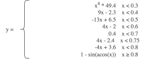
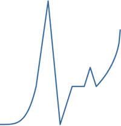
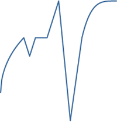
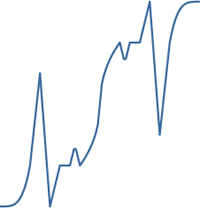

# Easing

Тепер знову звернемося до `easing` – наведу приклад довільної функції, якій слідуватиме анімація. Щоб особливо не фантазувати, я взяв приклад зі статті на колись популярному Хабрі про анімацію у MooTools фреймворку – наочний приклад із серцебиттям, яке описується наступними функціями:

<figure><figcaption></figcaption></figure>

У розширенні функціоналу easing немає нічого воєнного:

```javascript
$.extend($.easing, {
    /**
     * Heart Beat
     *
     * @param {Float} x progress
     */
    heart:function(x) {
        if (x < 0.3) return Math.pow(x, 4) * 49.4;
        if (x < 0.4) return 9 * x - 2.3;
        if (x < 0.5) return -13 * x + 6.5;
        if (x < 0.6) return 4 * x - 2;
        if (x < 0.7) return 0.4;
        if (x < 0.75) return 4 * x - 2.4;
        if (x < 0.8) return -4 * x + 3.6;
        if (x >= 0.8) return 1 - Math.sin(Math.acos(x));
    }
});
```

Трішки пояснень, конструкція `$.extend({}, {})` «змішує» об'єкти:

```javascript
$.extend({name:"Anton"}, {location:"Kharkiv"});
// >>>
{
  "name": "Anton",
  "location": "Kharkiv"
};

$.extend({name:"Anton", location:"Kharkiv"}, {location:"Kyiv"});
// >>>
{
  "name": "Anton",
  "location": "Kyiv"
}
```

Таким чином ми «вмішуємо» новий метод до наявного об'єкта `$.easing`; згідно з кодом, наш метод приймає як параметр лише одне значення:

`x` – коефіцієнт проходження анімації, змінюється від 0 до 1, дробове

Результат, звісно, цікавий, але його можна ще трішки розширити додатковими функціями (розгорнемо та скомбінуємо):

```javascript
$.extend(jQuery.easing, {
    heartIn: function (x) {
        return $.easing.heart(x);
    },
    heartOut: function (x) {
        return $.easing.heart(1 - x);
    },
    heartInOut: function (x) {
        if (x < 0.5) return $.easing.heartIn(x);
        return $.easing.heartOut(x);
    }
});
```

Отримаємо наступні похідні функції:

|                  **heartIn**                  |                  **heartOut**                   |                   **heartInOut**                    |
|:---------------------------------------------:|:-----------------------------------------------:|:---------------------------------------------------:|
|  |  |  |

Працювати із цим витвором треба наступним чином:

```javascript
$("#my").animate({height:"+200px"}, 2000, "heartIn"); // ось воно
```

Приклад роботи цієї функції можна помацати на відповідній сторінці [animate.easing.html](https://anton.shevchuk.name/book/code/animate.easing.html):


