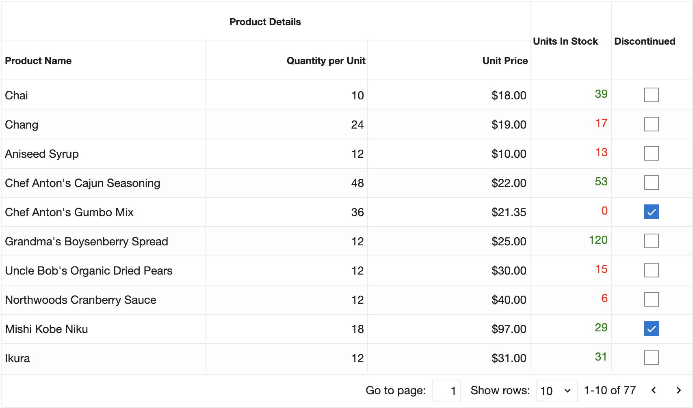
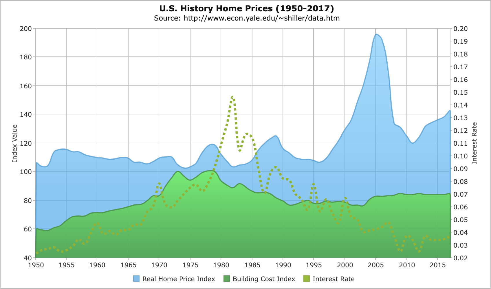
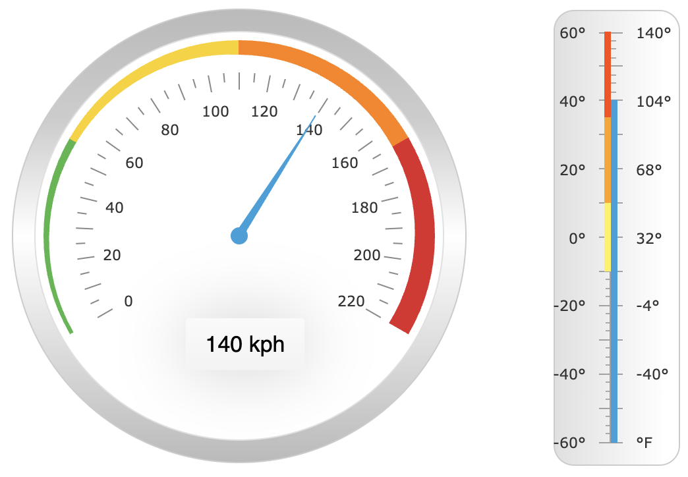
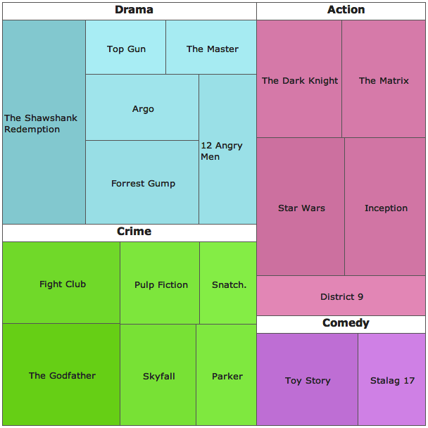

# jQWidgets

[jQWidgets](https://www.jqwidgets.com/) – це не просто бібліотека, а цілий комбайн з купою корисних віджетів. Їх на цей час налічується понад 60 штук, тож тільки навести список і знімок з екрана на кожен – уже пів книги буде. Тому обійдемося коротеньким резюме до кількох віджетів, сподіваюся, цього вистачить, щоб у вас розігравсь апетит, і ви зважилися б подивитись на сайт розробників.

*   jqxGrid – це датагрід з купою корисних і не дуже примочок. Тут, зрозуміла річ, є посторінкова навігація, сортування, фільтрації та групування. Тільки по цьому віджету вже можна здоровезний талмуд написати:

    <figure><figcaption></figcaption></figure>
*   jqxChart – віджет для побудови різноманітних графіків за допомогою HTML, CSS та JavaScript, зроблено все дуже й дуже культурно, особливо виділю функцію зі збереження графіка як картинки, іноді дуже її не вистачає:

    <figure><figcaption></figcaption></figure>
*   jqxGauge – цей віджет не часто зустрінеш і в більш відомих фреймворках, але по суті – це деякий вимірювач, тобто з його допомогою можна намалювати спідометр, манометр, термометр або інший вимірювальний прилад з довільною шкалою:

    <figure><figcaption></figcaption></figure>
*   jqxTreeMap – ще один рідкісний вид, скоріше навіть унікальний, з його допомогою можна побудувати зв'язане дерево у вигляді організованих прямокутників. Якщо нічого не зрозуміло, то краще подивитися [демку](https://www.jqwidgets.com/jquery-widgets-demo/demos/jqxtreemap/index.htm#demos/jqxtreemap/defaultfunctionality.htm), ну і скриншот додаю:

    <figure><figcaption></figcaption></figure>
*   jqxTree – це вже не такий екзотичний віджет; як зрозуміло з назви, будемо саджати дерева: 

    

На цьому огляд «крутих» віджетів можна завершувати, заглиблюватися в нудні та буденні обгортки над елементами форм мені не хочеться. Зазначу лише, що багато в чому цей фреймворк обходить jQuery UI, але не все так райдужно в цьому королівстві:


Цей фреймворк безплатний лише частково, у нього, звісно, є [Community ліцензія](https://www.jqwidgets.com/license/), але фактично вам таки треба буде брязнути гаманцем, якщо вам потрібні будуть віджети.


Ще варто згадати одну приємну особливість – можливість легкої інтеграції з різними JavaScript-фреймворками. Але це вже інша історія.
